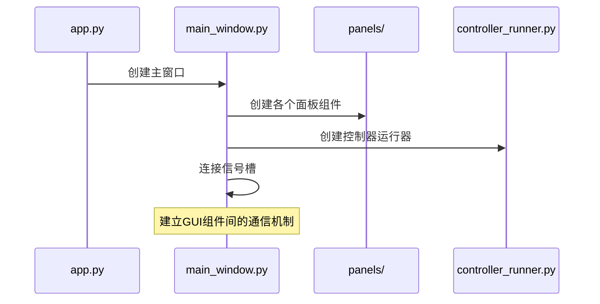
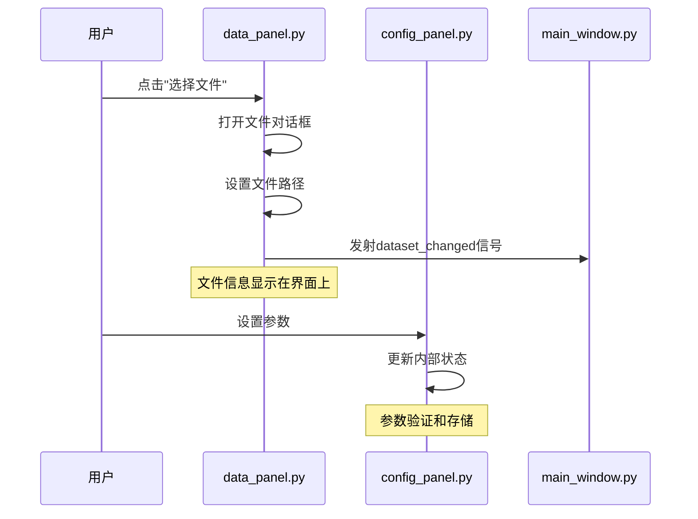
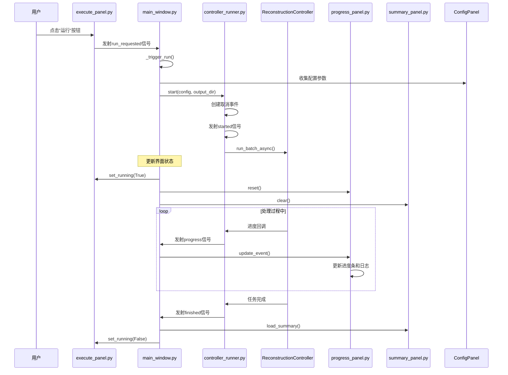
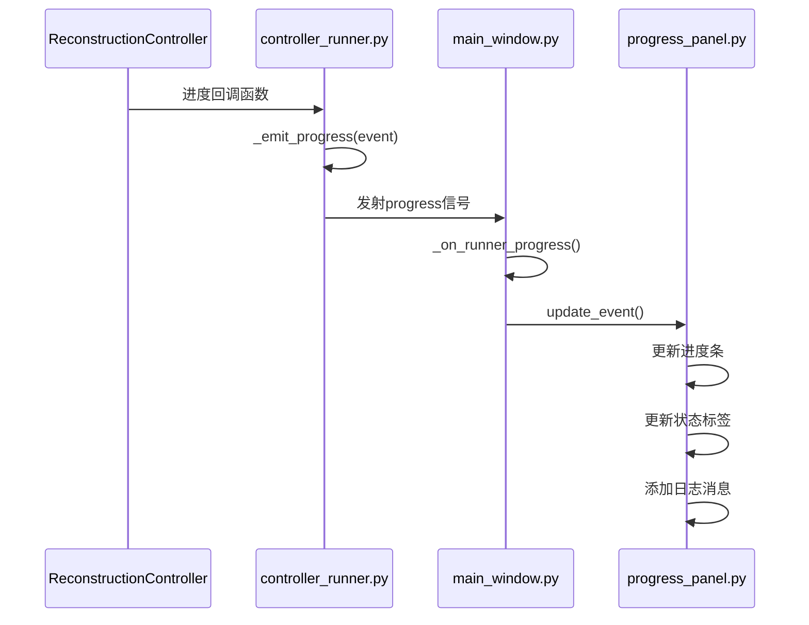
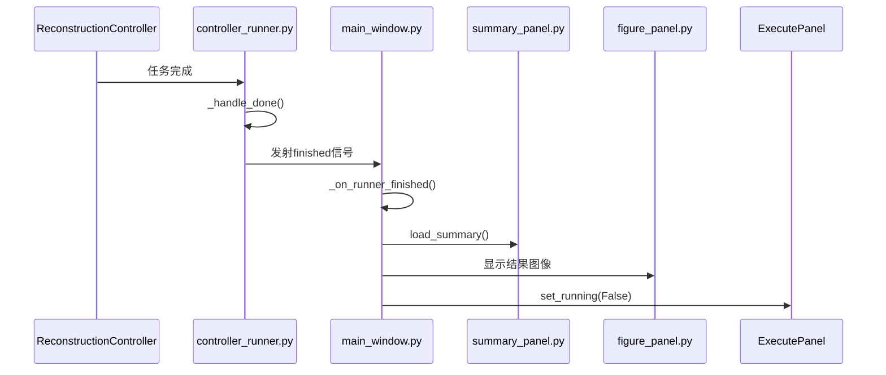

我来为你详细分析GUI操作的完整数据流，从用户点击运行到结果显示的整个过程。


[8 tools called]

现在我来为你详细分析GUI操作的完整数据流：

# 🎯 GUI操作完整数据流分析

## 📋 数据流概览

GUI的数据流可以分为以下几个阶段：
1. **初始化阶段**：界面组件创建和信号连接
2. **数据准备阶段**：用户选择文件和配置参数
3. **任务执行阶段**：点击运行后的异步处理
4. **结果展示阶段**：进度更新和结果显示

## 🔄 详细数据流分析

### 1. 初始化阶段数据流



**关键代码**：
```python
# app.py
def main():
    app = QtWidgets.QApplication(argv)
    window = MainWindow()  # 创建主窗口
    window.show()
    return app.exec()

# main_window.py
def __init__(self):
    # 创建各个面板
    self.data_panel = DataPanel()
    self.config_panel = ConfigPanel()
    self.execute_panel = ExecutePanel()
    self.progress_panel = ProgressPanel()
    self.summary_panel = SummaryPanel()
    self.figure_panel = FigurePanel()
    
    # 创建控制器运行器
    self._runner = ControllerRunner(self)
    
    # 连接信号槽
    self._connect_execute_panel()
```

### 2. 数据准备阶段数据流



**关键代码**：
```python
# data_panel.py
def _browse_file(self):
    path, _ = QtWidgets.QFileDialog.getOpenFileName(...)
    if path:
        self.set_file(Path(path))

def set_file(self, path: Path):
    self._current_file = path
    self.path_edit.setText(str(path))
    # 显示文件信息
    self.dataset_changed.emit(path)  # 发射信号

# config_panel.py
def build_config_kwargs(self, dataset_path: Path) -> Dict:
    # 从界面控件收集参数
    methods = []
    if self.linear_checkbox.isChecked():
        methods.append("linear")
    if self.mle_checkbox.isChecked():
        methods.append("mle")
    
    return {
        "input_path": dataset_path,
        "methods": tuple(methods),
        "dimension": self.dimension_spin.value(),
        # ... 其他参数
    }
```

### 3. 任务执行阶段数据流



**关键代码**：
```python
# execute_panel.py
def _build_ui(self):
    self.run_button = QtWidgets.QPushButton("运行")
    self.run_button.clicked.connect(self.run_requested)  # 连接信号

# main_window.py
def _connect_execute_panel(self):
    self.execute_panel.run_requested.connect(self._trigger_run)

def _trigger_run(self):
    config = self._build_config()  # 收集配置
    if config is None:
        return
    self._runner.start(config, config.output_dir)  # 启动任务

# controller_runner.py
def start(self, config, output_dir):
    self._cancel_event = Event()
    self.started.emit()  # 发射开始信号
    
    self._future = self._controller.run_batch_async(
        config,
        progress_callback=self._emit_progress,  # 进度回调
        cancel_event=self._cancel_event,
    )
    self._future.add_done_callback(self._handle_done)

def _emit_progress(self, event: ProgressEvent):
    self.progress.emit(event)  # 发射进度信号
```

### 4. 进度更新数据流



**关键代码**：
```python
# main_window.py
def _on_runner_progress(self, progress: ProgressEvent):
    self.progress_panel.update_event(progress)

# progress_panel.py
def update_event(self, event: ProgressEvent):
    percent = int(event.fraction * 100)
    self.progress_bar.setValue(percent)
    self.stage_label.setText(f"状态: {event.stage}")
    if event.sample_index is not None:
        self.sample_label.setText(f"样本: {event.sample_index + 1}/{event.total_samples}")
    
    if event.message:
        self._append_log(event.message)
```

### 5. 结果展示数据流



**关键代码**：
```python
# main_window.py
def _on_runner_finished(self, result):
    self.action_run.setEnabled(True)
    self.action_cancel.setEnabled(False)
    self.execute_panel.set_running(False)
    
    # 加载结果
    summary_path = self._current_result_dir / "summary.csv"
    if summary_path.exists():
        self.summary_panel.load_summary(summary_path)

# summary_panel.py
def load_summary(self, path: Path):
    df = pd.read_csv(path)
    self._model.clear()
    self._model.setHorizontalHeaderLabels(df.columns.tolist())
    
    for _, row in df.iterrows():
        items = [QtGui.QStandardItem(str(row[col])) for col in df.columns]
        self._model.appendRow(items)
```

## 🎯 关键数据流特点

### 1. 信号槽机制
- **解耦设计**：组件间通过信号槽通信，降低耦合度
- **异步处理**：GUI不阻塞，用户体验好
- **事件驱动**：响应式界面设计

### 2. 数据流向
```
用户操作 → 界面组件 → 信号发射 → 主窗口处理 → 业务逻辑 → 结果更新 → 界面显示
```

### 3. 状态管理
- **运行状态**：通过`set_running()`控制按钮状态
- **进度状态**：实时更新进度条和状态信息
- **结果状态**：动态加载和显示结果

### 4. 错误处理
- **参数验证**：配置面板验证用户输入
- **异常捕获**：运行器捕获和转发异常
- **用户提示**：通过消息框显示错误信息

这个数据流设计体现了现代GUI应用的最佳实践：**MVC模式**、**信号槽机制**、**异步处理**和**响应式更新**，确保了良好的用户体验和代码可维护性。