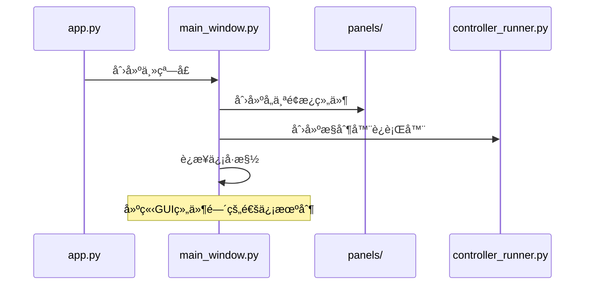
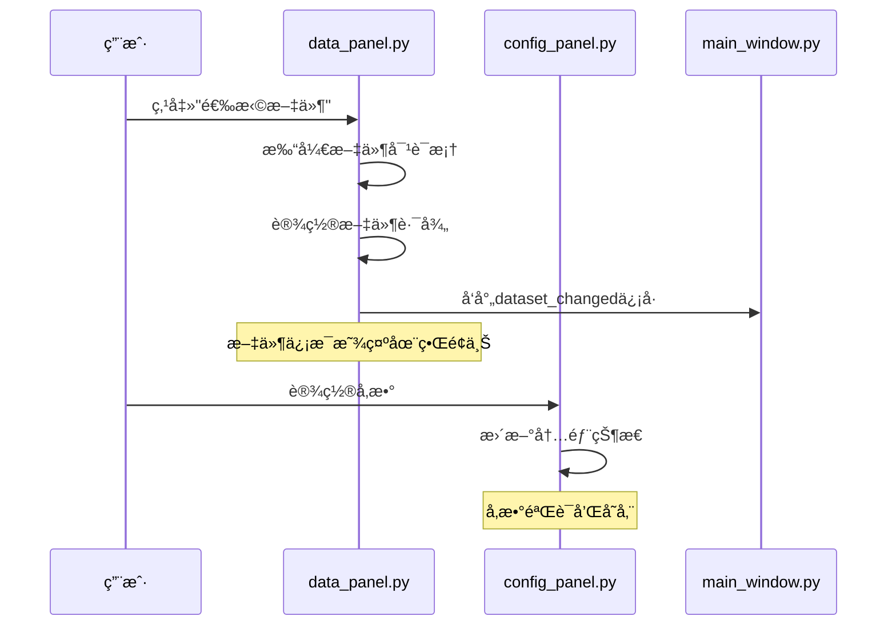
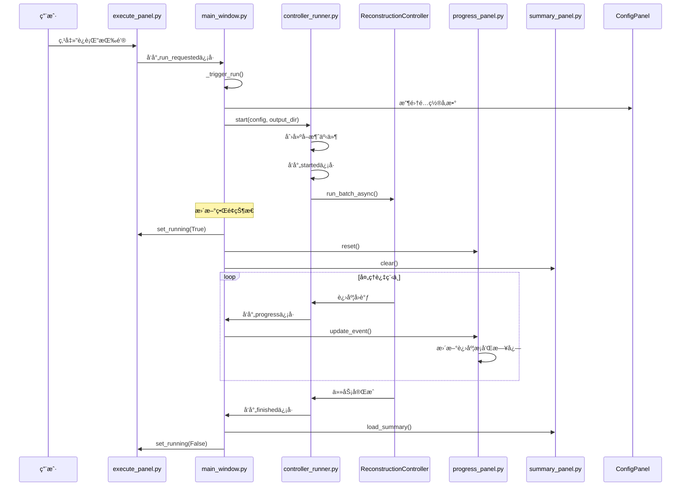
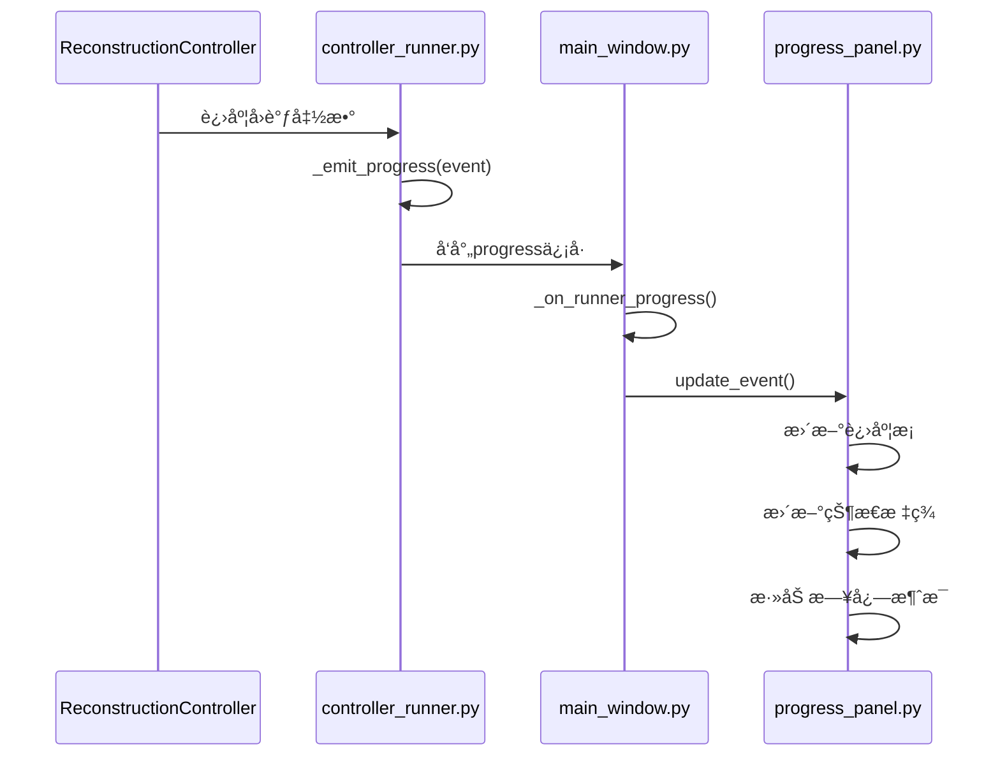
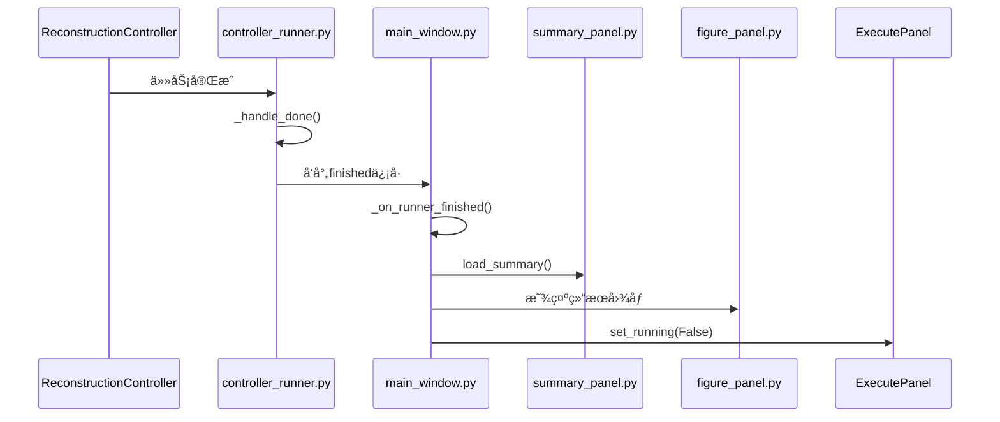

我æ¥ä¸ºä½ è¯¦ç»†åˆ†æGUIæ“作的完整数æ®æµï¼Œä»ç”¨æˆ·ç‚¹å‡»è¿è¡Œåˆ°ç»“æœæ˜¾ç¤ºçš„整个过程。


[8 tools called]

ç°åœ¨æˆ‘æ¥ä¸ºä½ è¯¦ç»†åˆ†æGUIæ“作的完整数æ®æµï¼š

# 🯠GUIæ“作完整数æ®æµåˆ†æ

## 📋 æ•°æ®æµæ¦‚览

GUIçš„æ•°æ®æµå¯ä»¥åˆ†ä¸ºä»¥ä¸‹å‡ ä¸ªé˜¶æ®µï¼š
1. **åˆå§‹åŒ–阶段**：界é¢ç»„件创建和信å·è¿æ¥
2. **æ•°æ®å‡†å¤‡é˜¶æ®µ**：用户选择文件和é…ç½®å‚æ•°
3. **任务执行阶段**：点击è¿è¡Œå的异步处ç†
4. **结æœå±•ç¤ºé˜¶æ®µ**：进度更新和结æœæ˜¾ç¤º

## 🔄 详细数æ®æµåˆ†æ

### 1. åˆå§‹åŒ–阶段数æ®æµ



**关键代ç **：
```python
# app.py
def main():
    app = QtWidgets.QApplication(argv)
    window = MainWindow()  # 创建主窗å£
    window.show()
    return app.exec()

# main_window.py
def __init__(self):
    # 创建å„个é¢æ¿
    self.data_panel = DataPanel()
    self.config_panel = ConfigPanel()
    self.execute_panel = ExecutePanel()
    self.progress_panel = ProgressPanel()
    self.summary_panel = SummaryPanel()
    self.figure_panel = FigurePanel()
    
    # 创建æ§åˆ¶å™¨è¿è¡Œå™¨
    self._runner = ControllerRunner(self)
    
    # è¿æ¥ä¿¡å·æ§½
    self._connect_execute_panel()
```

### 2. æ•°æ®å‡†å¤‡é˜¶æ®µæ•°æ®æµ



**关键代ç **：
```python
# data_panel.py
def _browse_file(self):
    path, _ = QtWidgets.QFileDialog.getOpenFileName(...)
    if path:
        self.set_file(Path(path))

def set_file(self, path: Path):
    self._current_file = path
    self.path_edit.setText(str(path))
    # 显示文件信æ¯
    self.dataset_changed.emit(path)  # å‘å°„ä¿¡å·

# config_panel.py
def build_config_kwargs(self, dataset_path: Path) -> Dict:
    # ä»ç•Œé¢æ§ä»¶æ”¶é›†å‚æ•°
    methods = []
    if self.linear_checkbox.isChecked():
        methods.append("linear")
    if self.mle_checkbox.isChecked():
        methods.append("mle")
    
    return {
        "input_path": dataset_path,
        "methods": tuple(methods),
        "dimension": self.dimension_spin.value(),
        # ... 其他å‚æ•°
    }
```

### 3. 任务执行阶段数æ®æµ



**关键代ç **：
```python
# execute_panel.py
def _build_ui(self):
    self.run_button = QtWidgets.QPushButton("è¿è¡Œ")
    self.run_button.clicked.connect(self.run_requested)  # è¿æ¥ä¿¡å·

# main_window.py
def _connect_execute_panel(self):
    self.execute_panel.run_requested.connect(self._trigger_run)

def _trigger_run(self):
    config = self._build_config()  # 收集é…ç½®
    if config is None:
        return
    self._runner.start(config, config.output_dir)  # å¯åŠ¨ä»»åŠ¡

# controller_runner.py
def start(self, config, output_dir):
    self._cancel_event = Event()
    self.started.emit()  # å‘射开始信å·
    
    self._future = self._controller.run_batch_async(
        config,
        progress_callback=self._emit_progress,  # 进度å›è°ƒ
        cancel_event=self._cancel_event,
    )
    self._future.add_done_callback(self._handle_done)

def _emit_progress(self, event: ProgressEvent):
    self.progress.emit(event)  # å‘射进度信å·
```

### 4. 进度更新数æ®æµ



**关键代ç **：
```python
# main_window.py
def _on_runner_progress(self, progress: ProgressEvent):
    self.progress_panel.update_event(progress)

# progress_panel.py
def update_event(self, event: ProgressEvent):
    percent = int(event.fraction * 100)
    self.progress_bar.setValue(percent)
    self.stage_label.setText(f"状æ€: {event.stage}")
    if event.sample_index is not None:
        self.sample_label.setText(f"样本: {event.sample_index + 1}/{event.total_samples}")
    
    if event.message:
        self._append_log(event.message)
```

### 5. 结æœå±•ç¤ºæ•°æ®æµ



**关键代ç **：
```python
# main_window.py
def _on_runner_finished(self, result):
    self.action_run.setEnabled(True)
    self.action_cancel.setEnabled(False)
    self.execute_panel.set_running(False)
    
    # 加载结æœ
    summary_path = self._current_result_dir / "summary.csv"
    if summary_path.exists():
        self.summary_panel.load_summary(summary_path)

# summary_panel.py
def load_summary(self, path: Path):
    df = pd.read_csv(path)
    self._model.clear()
    self._model.setHorizontalHeaderLabels(df.columns.tolist())
    
    for _, row in df.iterrows():
        items = [QtGui.QStandardItem(str(row[col])) for col in df.columns]
        self._model.appendRow(items)
```

## 🯠关键数æ®æµç‰¹ç‚¹

### 1. ä¿¡å·æ§½æœºåˆ¶
- **解耦设计**：组件间通过信å·æ§½é€šä¿¡ï¼Œé™ä½è€¦åˆåº¦
- **异步处ç†**：GUIä¸é˜»å¡ï¼Œç”¨æˆ·ä½“验好
- **事件驱动**：å“应å¼ç•Œé¢è®¾è®¡

### 2. æ•°æ®æµå‘
```
用户æ“作 → ç•Œé¢ç»„件 → ä¿¡å·å‘å°„ → 主窗å£å¤„ç† â†’ 业务逻辑 → 结æœæ›´æ–° → ç•Œé¢æ˜¾ç¤º
```

### 3. 状æ€ç®¡ç†
- **è¿è¡ŒçŠ¶æ€**：通过`set_running()`æ§åˆ¶æŒ‰é’®çŠ¶æ€
- **进度状æ€**：å®æ—¶æ›´æ–°è¿›åº¦æ¡å’ŒçŠ¶æ€ä¿¡æ¯
- **结æœçŠ¶æ€**：动æ€åŠ è½½å’Œæ˜¾ç¤ºç»“æœ

### 4. 错误处ç†
- **å‚数验è¯**：é…ç½®é¢æ¿éªŒè¯ç”¨æˆ·è¾“å…¥
- **异常æ•è·**：è¿è¡Œå™¨æ•è·å’Œè½¬å‘异常
- **用户æ示**：通过消æ¯æ¡†æ˜¾ç¤ºé”™è¯¯ä¿¡æ¯

这个数æ®æµè®¾è®¡ä½“ç°äº†ç°ä»£GUI应用的最佳å®è·µï¼š**MVC模å¼**ã€**ä¿¡å·æ§½æœºåˆ¶**ã€**异步处ç†**å’Œ**å“应å¼æ›´æ–°**，确ä¿äº†è‰¯å¥½çš„用户体验和代ç å¯ç»´æŠ¤æ€§ã€‚