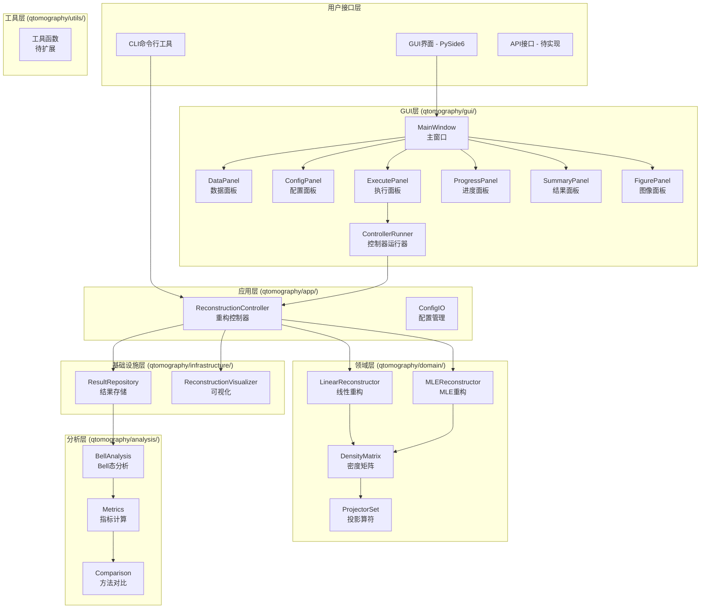
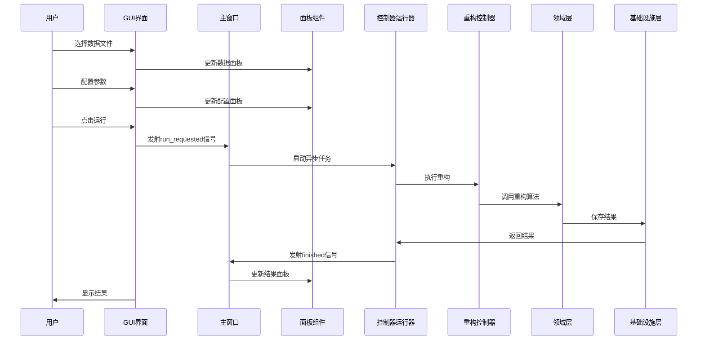
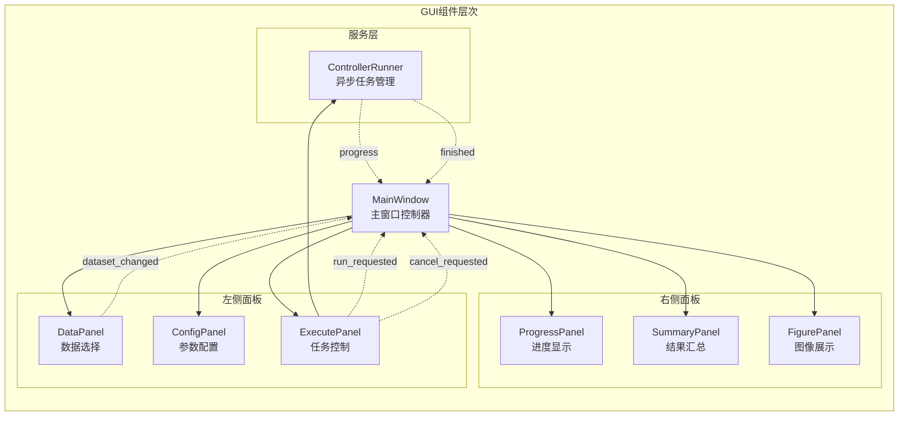
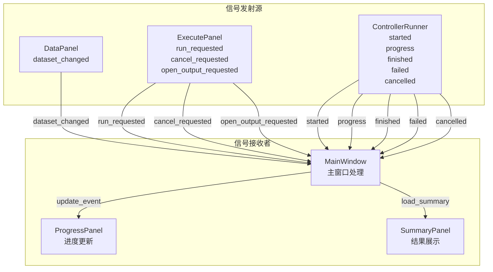

# GUI数据流架构图表

> **用途**: 用于截图展示GUI层的数据流和架构关系  
> **创建日期**: 2025年1月  
> **版本**: v1.0  

---

## 🎯 完整架构图

---

## 🔄 数据流时序图

---

## 📊 GUI组件关系图

---

## 🎯 信号槽连接图

---

## 📋 使用说明

### 截图建议
1. **完整架构图**: 适合展示整体系统架构
2. **数据流时序图**: 适合展示用户操作流程
3. **GUI组件关系图**: 适合展示界面组件层次
4. **信号槽连接图**: 适合展示事件处理机制

### 图表特点
- **清晰分层**: 不同颜色区分不同层次
- **关系明确**: 箭头表示依赖和调用关系
- **组件详细**: 包含具体的类名和职责
- **易于理解**: 适合技术文档和演示

### 导出建议
- 使用Mermaid在线编辑器导出PNG/SVG
- 建议分辨率: 1920x1080或更高
- 背景色: 白色或浅色
- 字体大小: 12-14px

---

## 🔧 自定义选项

如需修改图表，可以调整以下参数：
- **颜色主题**: 修改subgraph样式
- **节点形状**: 调整方括号样式
- **箭头类型**: 使用不同箭头符号
- **布局方向**: 修改graph TB/LR/TD等

---

*此文档专门用于生成GUI数据流架构图表，便于截图和演示使用。*
