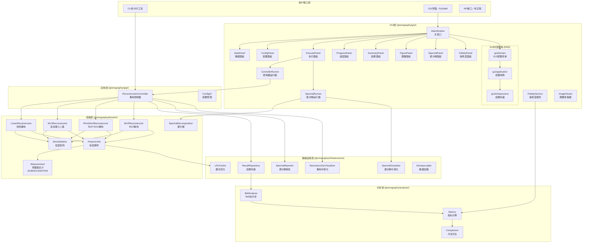
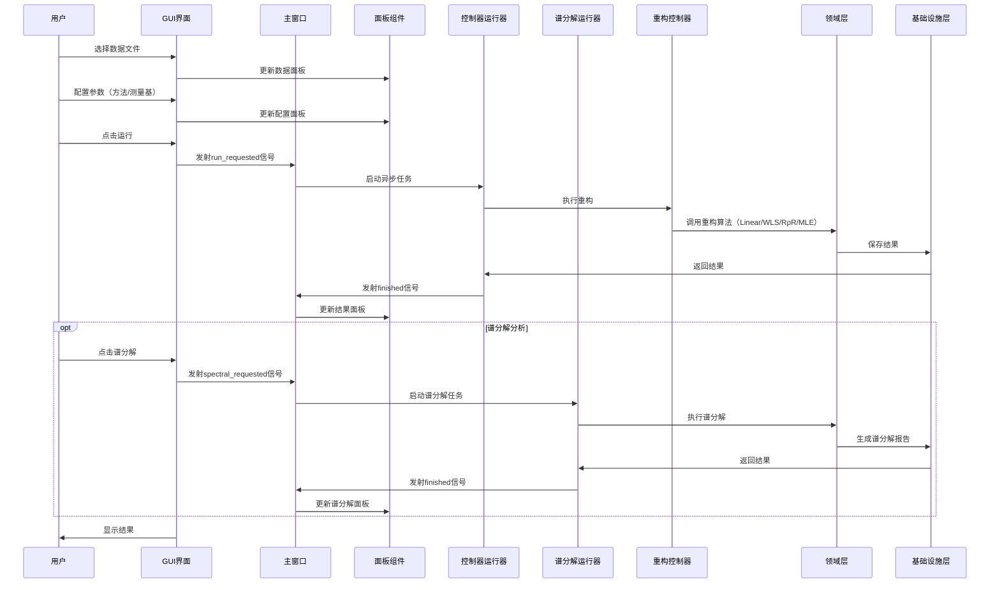
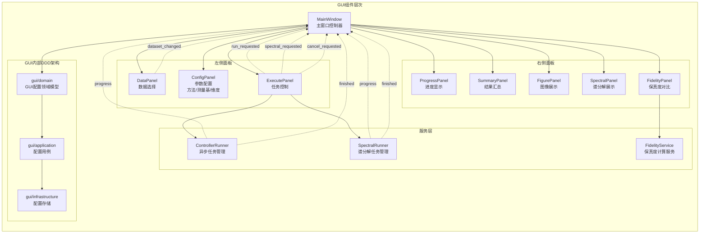
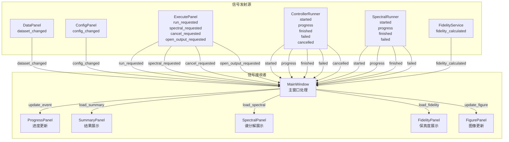
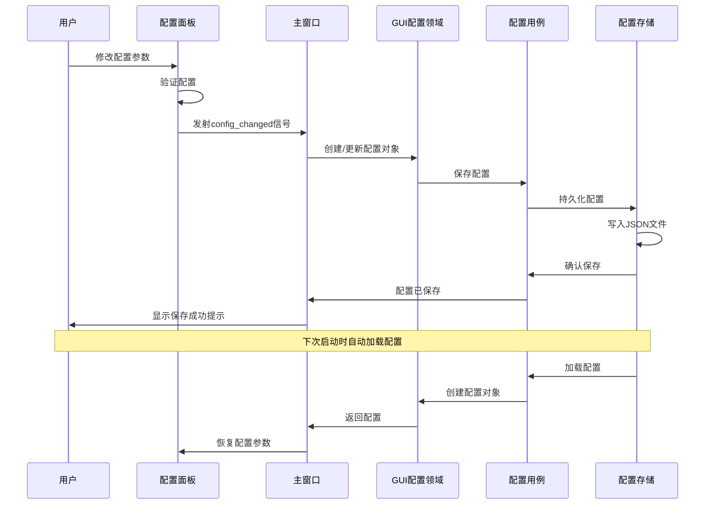

# GUI数据流架构图表

> **用途**: 用于截图展示GUI层的数据流和架构关系  
> **创建日期**: 2025年1月  
> **更新日期**: 2025年11月  
> **版本**: v2.0  
> **项目版本**: v1.0.0

---

## 🎯 完整架构图



---

## 🔄 数据流时序图



---

## 📊 GUI组件关系图



---

## 🎯 信号槽连接图



---

## 🔄 GUI配置数据流（DDD架构）



---

## 📋 GUI面板功能说明

### **1. 数据面板 (DataPanel)**
- 文件选择：支持CSV/Excel文件
- 元数据显示：维度、样本数、文件路径
- 数据预览：显示前几行数据

### **2. 配置面板 (ConfigPanel)**
- 重构方法选择：Linear、WLS、RρR Strict、MLE（多选）
- 测量基设计：MUB、SIC、NoPOVM（单选）
- 维度设置：2、4、8、16等
- 高级参数：容差、正则化、迭代次数等

### **3. 执行面板 (ExecutePanel)**
- 运行按钮：启动重构任务
- 谱分解按钮：启动谱分解分析
- 取消按钮：取消正在运行的任务
- 打开输出目录：打开结果文件夹

### **4. 进度面板 (ProgressPanel)**
- 进度条：显示任务进度
- 状态信息：当前处理的样本、方法
- 时间信息：已用时间、预计剩余时间

### **5. 结果面板 (SummaryPanel)**
- 结果汇总表：显示所有样本的重构结果
- 指标列：purity、trace、rank、condition_number等
- 方法对比：不同重构算法的结果对比
- 排序和筛选：支持按指标排序和筛选

### **6. 图像面板 (FigurePanel)**
- 密度矩阵热图：2D可视化
- 幅度相位图：3D柱状图
- 实部虚部图：3D柱状图
- 图像查看器：支持缩放、平移、保存

### **7. 谱分解面板 (SpectralPanel)**
- 特征值列表：显示所有特征值
- 特征向量显示：显示主要特征向量
- 特征值分布图：可视化特征值分布
- 理论态对比：与理论态的特征值对比

### **8. 保真度面板 (FidelityPanel)**
- 保真度计算：与理论态的保真度
- 方法对比：不同方法的保真度对比
- 保真度图表：可视化保真度分布

---

## 🎯 GUI内部DDD架构说明

### **Domain层 (gui/domain/)**
```python
# GUI配置领域模型
class GUIConfig:
    """GUI配置领域对象"""
    def __init__(self, method: str, design: str, dimension: int, ...):
        self.method = method
        self.design = design
        self.dimension = dimension
        # ... 其他配置项
```

### **Application层 (gui/application/)**
```python
# GUI配置用例
class GUIConfigUseCase:
    """GUI配置用例"""
    def __init__(self, repository: GUIConfigRepository):
        self.repository = repository
    
    def save_config(self, config: GUIConfig) -> None:
        """保存配置"""
        self.repository.save(config)
    
    def load_config(self) -> Optional[GUIConfig]:
        """加载配置"""
        return self.repository.load()
```

### **Infrastructure层 (gui/infrastructure/)**
```python
# GUI配置存储
class GUIConfigRepository:
    """GUI配置存储实现"""
    def save(self, config: GUIConfig) -> None:
        """保存配置到JSON文件"""
        # 实现细节
    
    def load(self) -> Optional[GUIConfig]:
        """从JSON文件加载配置"""
        # 实现细节
```

---

## 📋 使用说明

### 截图建议
1. **完整架构图**: 适合展示整体系统架构（包含GUI内部DDD）
2. **数据流时序图**: 适合展示用户操作流程（包含谱分解流程）
3. **GUI组件关系图**: 适合展示界面组件层次（包含新面板）
4. **信号槽连接图**: 适合展示事件处理机制（包含新信号）
5. **GUI配置数据流**: 适合展示GUI内部DDD架构

### 图表特点
- **清晰分层**: 不同颜色区分不同层次
- **关系明确**: 箭头表示依赖和调用关系
- **组件详细**: 包含具体的类名和职责
- **易于理解**: 适合技术文档和演示
- **DDD架构**: 展示GUI内部的领域驱动设计

### 导出建议
- 使用Mermaid在线编辑器导出PNG/SVG
- 建议分辨率: 1920x1080或更高
- 背景色: 白色或浅色
- 字体大小: 12-14px

---

## 🔧 自定义选项

如需修改图表，可以调整以下参数：
- **颜色主题**: 修改subgraph样式
- **节点形状**: 调整方括号样式
- **箭头类型**: 使用不同箭头符号
- **布局方向**: 修改graph TB/LR/TD等

---

## 🆕 更新说明（v2.0）

### 新增组件
- ✅ **SpectralPanel**: 谱分解面板
- ✅ **FidelityPanel**: 保真度面板
- ✅ **SpectralRunner**: 谱分解任务运行器
- ✅ **FidelityService**: 保真度计算服务
- ✅ **ImageViewer**: 图像查看器组件

### 新增功能
- ✅ **多算法支持**: Linear、WLS、RρR Strict、MLE
- ✅ **多测量基设计**: MUB、SIC、NoPOVM
- ✅ **谱分解分析**: 特征值分解和可视化
- ✅ **保真度计算**: 与理论态的保真度对比
- ✅ **GUI内部DDD**: 配置管理的领域驱动设计

### 架构改进
- ✅ **GUI内部DDD**: domain/application/infrastructure分层
- ✅ **服务分离**: 不同功能使用不同的服务类
- ✅ **信号扩展**: 新增谱分解和保真度相关信号

---

*此文档专门用于生成GUI数据流架构图表，便于截图和演示使用。已更新至v2.0，反映v1.0.0项目的最新架构。*
