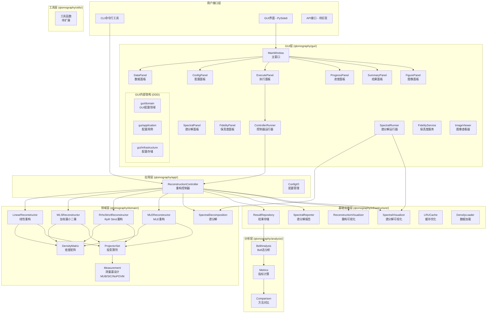
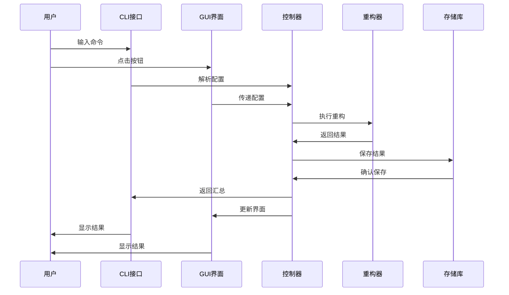
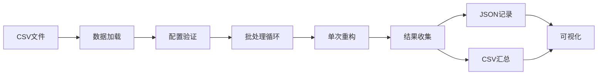
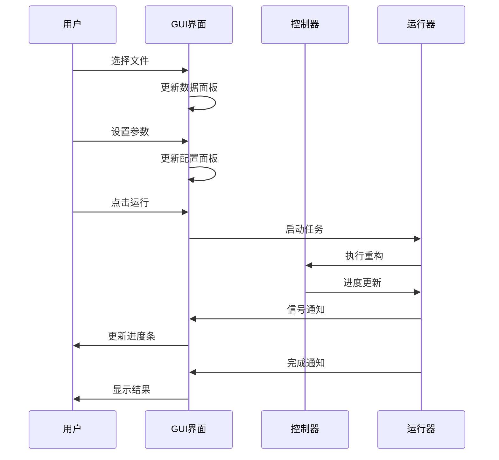
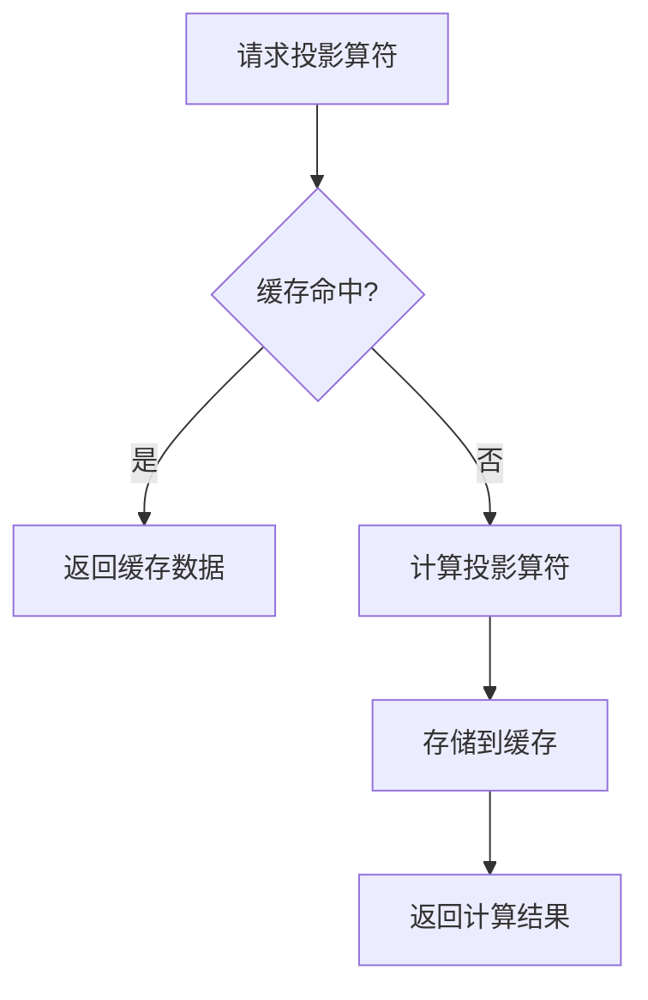
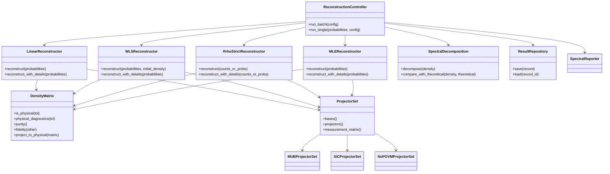

# 量子态层析重构系统 - Python程序架构分析

> **分析日期**: 2025年11月  
> **项目版本**: v1.0.0  
> **架构模式**: DDD-lite（轻量级领域驱动设计）+ 策略模式 + MVC

---

## 📋 目录
- [项目概述](#项目概述)
- [整体架构](#整体架构)
- [分层设计](#分层设计)
- [核心模块分析](#核心模块分析)
- [设计模式应用](#设计模式应用)
- [数据流分析](#数据流分析)
- [依赖关系图](#依赖关系图)
- [架构优势](#架构优势)
- [改进建议](#改进建议)

---

## 项目概述

### 基本信息
| 项目 | 详情 |
|------|------|
| **项目名称** | qtomography - 高维OAM全息图生成与量子层析一体化工具链 |
| **当前版本** | v1.0.0 |
| **代码规模** | ~8000+ 行代码，50+ 个模块 |
| **测试覆盖** | 36+ 单元/集成测试，与MATLAB基准对齐（误差 < 1e-10） |
| **架构模式** | DDD-lite（轻量级领域驱动设计）+ 策略模式 + MVC |
| **技术栈** | Python 3.9+, NumPy, SciPy, Pandas, Matplotlib, PySide6 |

### 核心功能
- **量子态重构**: 线性重构（Linear）+ 加权最小二乘（WLS）+ RρR Strict重构 + MLE重构
- **测量基支持**: MUB、SIC、NoPOVM等多种测量设计
- **Bell态分析**: 纠缠度评估与可视化
- **谱分解分析**: 密度矩阵特征值分解与可视化
- **批处理**: 多样本并行处理
- **结果持久化**: JSON记录 + CSV汇总 + 谱分解报告
- **可视化**: 密度矩阵、保真度、3D图表、谱分解可视化
- **图形界面**: PySide6桌面GUI应用，支持实时进度显示和交互式可视化

### 架构定位
本项目采用**DDD-lite（轻量级领域驱动设计）+ MVC**架构，具备以下特点：
- ✅ 清晰的分层结构（接口层、应用层、领域层、基础设施层）
- ✅ 领域模型的部分实现（DensityMatrix、ProjectorSet等实体）
- ✅ 策略模式的应用（多种重构算法）
- ✅ MVC模式的应用（GUI界面分离）
- ⚠️ 尚未达到完整DDD标准（缺少聚合根、领域事件等）

**说明**: 这是一个优秀的DDD-lite + MVC架构，适合中小型项目，平衡了复杂度和实用性，无需强制升级到完整DDD。

---

## 整体架构

### 架构图

#### 手绘风格架构图
```
┌─────────────────────────────────────────────────────────────────┐
│                    🎯 量子态层析重构系统架构图                    │
│                      (DDD-lite + 策略模式)                      │
└─────────────────────────────────────────────────────────────────┘

┌─────────────────────────────────────────────────────────────────┐
│  📱 接口层 (Interface Layer)                                    │
│  ┌─────────────┐  ┌─────────────┐  ┌─────────────┐             │
│  │    CLI      │  │    GUI      │  │    API      │             │
│  │ (已实现)     │  │ (已实现)     │  │ (计划中)     │             │
│  │ cli/main.py │  │ gui/app.py  │  │   待开发     │             │
│  └─────────────┘  └─────────────┘  └─────────────┘             │
└─────────────────────────────────────────────────────────────────┘
                                ↓
┌─────────────────────────────────────────────────────────────────┐
│  🎮 应用层 (Application Layer)                                  │
│  ┌─────────────────────┐  ┌─────────────────────┐               │
│  │   Controller        │  │   Config            │               │
│  │ 重构流程控制         │  │ 配置管理             │               │
│  │ app/controller.py   │  │ app/config_io.py    │               │
│  └─────────────────────┘  └─────────────────────┘               │
└─────────────────────────────────────────────────────────────────┘
                                ↓
┌─────────────────────────────────────────────────────────────────┐
│  🧠 领域层 (Domain Layer) - 核心业务逻辑                        │
│  ┌─────────────┐  ┌─────────────┐  ┌─────────────┐             │
│  │  Density    │  │ Projectors  │  │Reconstruction│             │
│  │ 密度矩阵     │  │ 投影算符     │  │   重构算法   │             │
│  │density.py   │  │projectors.py│  │linear/wls/  │             │
│  │             │  │measurement/ │  │rhor_strict/ │             │
│  │             │  │             │  │mle         │             │
│  └─────────────┘  └─────────────┘  └─────────────┘             │
└─────────────────────────────────────────────────────────────────┘
                                ↓
┌─────────────────────────────────────────────────────────────────┐
│  📊 分析层 (Analysis Layer) - 业务扩展层                        │
│  ┌─────────────┐  ┌─────────────┐  ┌─────────────┐             │
│  │    Bell     │  │   Metrics   │  │ Comparison  │             │
│  │ Bell态分析   │  │   指标计算   │  │   方法对比   │             │
│  │ bell.py     │  │ metrics.py  │  │comparison.py│             │
│  └─────────────┘  └─────────────┘  └─────────────┘             │
└─────────────────────────────────────────────────────────────────┘
                                ↓
┌─────────────────────────────────────────────────────────────────┐
│  🏗️ 基础设施层 (Infrastructure Layer)                          │
│  ┌─────────────────────┐  ┌─────────────────────┐               │
│  │   Repository        │  │   Visualizer        │               │
│  │   结果存储           │  │   可视化             │               │
│  │ persistence/        │  │ visualization/      │               │
│  │   Cache             │  │   IO                │               │
│  │   缓存优化           │  │   数据加载           │               │
│  └─────────────────────┘  └─────────────────────┘               │
└─────────────────────────────────────────────────────────────────┘
                                ↓
┌─────────────────────────────────────────────────────────────────┐
│  🔧 工具层 (Utils Layer) - 技术扩展层                           │
│  ┌─────────────────────────────────────────────────────────────┐ │
│  │                    Utils                                  │ │
│  │                  工具函数                                   │ │
│  │                 utils/ (待扩展)                            │ │
│  └─────────────────────────────────────────────────────────────┘ │
└─────────────────────────────────────────────────────────────────┘

┌─────────────────────────────────────────────────────────────────┐
│  📋 数据流向说明                                                │
│  CLI → Controller → Domain → Analysis → Infrastructure → Utils  │
│  ↑                    ↑         ↑           ↑           ↑      │
│  用户输入              核心逻辑   后处理分析   技术实现    工具支持  │
└─────────────────────────────────────────────────────────────────┘

┌─────────────────────────────────────────────────────────────────┐
│  🎯 设计模式应用                                                │
│  • 策略模式: 重构算法选择 (Linear/WLS/RρR Strict/MLE)        │
│  • 策略模式: 测量基设计选择 (MUB/SIC/NoPOVM)                   │
│  • 工厂模式: 配置对象创建                                       │
│  • 单例模式: 投影算符缓存（LRU优化）                            │
│  • 模板方法: 重构流程标准化                                     │
│  • MVC模式: GUI界面分离 (Model-View-Controller)                │
│  • 观察者模式: GUI事件处理 (Qt信号槽机制)                       │
│  • DDD模式: GUI内部采用领域驱动设计（domain/application/infra） │
└─────────────────────────────────────────────────────────────────┘
```

#### 手绘风格说明
这个架构图采用了手绘风格的特点：
1. **边框设计**：使用 `┌─┐` 和 `└─┘` 字符绘制边框
2. **层次清晰**：每层用不同的符号和颜色标识
3. **模块分组**：相关模块用方框包围
4. **箭头指向**：用 `↓` 表示依赖关系
5. **说明文字**：在底部添加了数据流向和设计模式说明

**视觉特点**：
- **层次感**：从上到下的依赖关系清晰
- **模块化**：每个模块都有明确的边界
- **扩展性**：分析层和工具层用不同颜色标识为扩展层
- **实用性**：标注了实现状态（已实现/计划中/待扩展）

#### 传统Mermaid架构图



### 目录结构

```
qtomography/
├── __init__.py                 # 包初始化
├── domain/                     # 领域层 - 核心业务逻辑
│   ├── __init__.py
│   ├── density.py              # 密度矩阵实体
│   ├── projectors.py           # 投影算符集合
│   ├── projectors_optimized.py # 优化版投影算符
│   ├── theoretical_state.py     # 理论态生成
│   ├── spectral_decomposition.py # 谱分解
│   ├── measurement/            # 测量基设计
│   │   ├── mub.py              # MUB测量基
│   │   ├── sic.py              # SIC-POVM测量基
│   │   └── nopovm.py           # NoPOVM测量基
│   ├── reconstruction/         # 重构算法
│   │   ├── __init__.py
│   │   ├── linear.py           # 线性重构
│   │   ├── wls.py              # 加权最小二乘重构
│   │   ├── rhor_strict.py     # RρR Strict重构
│   │   └── mle.py              # MLE重构
│   ├── persistence/            # 持久化接口
│   │   ├── __init__.py
│   │   └── result_repository.py
│   └── ports/                  # 端口定义
│       ├── __init__.py
│       └── persistence.py
├── app/                        # 应用层 - 流程编排
│   ├── __init__.py
│   ├── controller.py           # 重构控制器
│   ├── config_io.py            # 配置管理
│   └── exceptions.py           # 异常定义
├── analysis/                   # 分析层 - 后处理分析
│   ├── __init__.py
│   ├── bell.py                 # Bell态分析
│   ├── metrics.py              # 指标计算
│   └── comparison.py           # 方法对比
├── infrastructure/             # 基础设施层
│   ├── __init__.py
│   ├── persistence/            # 持久化实现
│   │   ├── __init__.py
│   │   ├── result_repository.py
│   │   └── spectral_reporter.py # 谱分解报告
│   ├── visualization/          # 可视化
│   │   ├── __init__.py
│   │   ├── reconstruction_visualizer.py
│   │   ├── spectral_visualizer.py # 谱分解可视化
│   │   ├── qt_adapter.py       # Qt适配器
│   │   └── export.py           # 图像导出
│   ├── cache/                  # 缓存优化
│   │   ├── optimized_lru.py    # LRU缓存优化
│   │   └── performance_comparison.py
│   └── io/                     # 数据IO
│       ├── __init__.py
│       └── density_loader.py   # 密度矩阵加载器
├── cli/                        # 命令行接口
│   ├── __init__.py
│   └── main.py                 # CLI入口
├── gui/                        # 图形用户界面
│   ├── __init__.py
│   ├── __main__.py             # GUI模块入口
│   ├── app.py                  # GUI应用入口
│   ├── main_window.py          # 主窗口
│   ├── panels/                 # 界面面板
│   │   ├── data_panel.py       # 数据面板
│   │   ├── config_panel.py     # 配置面板
│   │   ├── execute_panel.py    # 执行面板
│   │   ├── progress_panel.py   # 进度面板
│   │   ├── summary_panel.py    # 结果面板
│   │   ├── figure_panel.py     # 图像面板
│   │   ├── spectral_panel.py  # 谱分解面板
│   │   └── fidelity_panel.py  # 保真度面板
│   ├── services/               # GUI服务
│   │   ├── controller_runner.py # 控制器运行器
│   │   ├── spectral_runner.py  # 谱分解运行器
│   │   └── fidelity_service.py # 保真度服务
│   ├── widgets/                # GUI组件
│   │   └── image_viewer.py     # 图像查看器
│   ├── domain/                 # GUI领域层（DDD）
│   │   ├── __init__.py
│   │   └── gui_config.py       # GUI配置领域模型
│   ├── application/            # GUI应用层（DDD）
│   │   ├── __init__.py
│   │   └── use_cases/
│   │       └── gui_config_use_case.py # 配置用例
│   └── infrastructure/         # GUI基础设施层（DDD）
│       ├── __init__.py
│       └── repositories/
│           └── gui_config_repository.py # 配置存储
├── visualization/              # 可视化模块（兼容层）
│   ├── __init__.py
│   └── reconstruction_visualizer.py
└── utils/                      # 工具模块（待扩展）
    └── __init__.py
```

---

## 分层设计

### 分层设计说明

本项目在标准DDD四层架构基础上，根据业务特点进行了合理扩展：

**标准DDD四层**：
- 接口层、应用层、领域层、基础设施层

**本项目六层**：
- 接口层：CLI命令行接口
- 应用层：业务流程编排（controller、config）
- 领域层：核心业务逻辑（density、projectors、reconstruction）
- 分析层：后处理分析（bell、metrics、comparison）← 业务扩展
- 基础设施层：技术实现（persistence、visualization）
- 工具层：纯技术工具（utils）← 技术扩展

**扩展理由**：
- 分析层：量子层析中分析功能业务价值高，独立成层更清晰
- 工具层：纯技术工具独立管理，避免污染业务层

### 1. 用户接口层 (Interface Layer)
**职责**: 处理用户输入，提供多种交互方式

| 模块 | 文件 | 职责 | 状态 |
|------|------|------|------|
| **CLI** | `cli/main.py` | 命令行参数解析、命令分发 | ✅ 已实现 |
| **GUI** | `gui/app.py` | PySide6图形用户界面 | ✅ 已实现 |
| **API** | 待实现 | REST API接口 | ⏳ 计划中 |

**特点**:
- 统一的命令接口设计
- 支持批处理和单次处理
- 配置驱动的参数管理
- 现代化的GUI界面（PySide6）
- 响应式布局和实时更新

### 2. 应用层 (Application Layer)
**职责**: 业务流程编排，协调各领域服务

| 模块 | 文件 | 职责 | 核心类 |
|------|------|------|--------|
| **Controller** | `app/controller.py` | 重构流程控制 | `ReconstructionController` |
| **Config** | `app/config_io.py` | 配置管理 | `load_config_file`, `dump_config_file` |

**核心功能**:
- 批处理任务调度
- 配置验证与转换
- 结果汇总与报告生成

### 3. 领域层 (Domain Layer)
**职责**: 核心业务逻辑，量子态重构算法

| 模块 | 文件 | 职责 | 核心类 |
|------|------|------|--------|
| **Density** | `domain/density.py` | 密度矩阵实体 | `DensityMatrix` |
| **Projectors** | `domain/projectors.py` | 投影算符管理 | `ProjectorSet` |
| **Measurement** | `domain/measurement/` | 测量基设计 | `MUBProjectorSet`, `SICProjectorSet`, `NoPOVMProjectorSet` |
| **Linear** | `domain/reconstruction/linear.py` | 线性重构算法 | `LinearReconstructor` |
| **WLS** | `domain/reconstruction/wls.py` | 加权最小二乘重构 | `WLSReconstructor` |
| **RρR Strict** | `domain/reconstruction/rhor_strict.py` | RρR Strict重构 | `RrhoStrictReconstructor` |
| **MLE** | `domain/reconstruction/mle.py` | MLE重构算法 | `MLEReconstructor` |
| **Spectral** | `domain/spectral_decomposition.py` | 谱分解分析 | `SpectralDecomposition` |

**设计特点**:
- 实体-值对象模式
- 策略模式实现不同重构算法
- 缓存机制优化性能

### 4. 分析层 (Analysis Layer) - 业务扩展层
**职责**: 后处理分析，指标计算

| 模块 | 文件 | 职责 | 核心类 |
|------|------|------|--------|
| **Bell** | `analysis/bell.py` | Bell态分析 | `BellAnalyzer` |
| **Metrics** | `analysis/metrics.py` | 指标计算 | `FidelityCalculator` |
| **Comparison** | `analysis/comparison.py` | 方法对比 | `MethodComparator` |

**分析功能**:
- 保真度计算
- 纠缠度评估
- 重构方法对比

**扩展理由**: 量子层析中分析功能业务价值高，独立成层更清晰

### 5. 基础设施层 (Infrastructure Layer)
**职责**: 技术基础设施，数据持久化

| 模块 | 文件 | 职责 | 核心类 |
|------|------|------|--------|
| **Repository** | `infrastructure/persistence/result_repository.py` | 结果存储 | `ResultRepository` |
| **SpectralRepo** | `infrastructure/persistence/spectral_reporter.py` | 谱分解报告 | `SpectralReporter` |
| **Visualizer** | `infrastructure/visualization/reconstruction_visualizer.py` | 重构可视化 | `ReconstructionVisualizer` |
| **SpectralViz** | `infrastructure/visualization/spectral_visualizer.py` | 谱分解可视化 | `SpectralVisualizer` |
| **Cache** | `infrastructure/cache/optimized_lru.py` | LRU缓存优化 | `OptimizedLRUCache` |
| **IO** | `infrastructure/io/density_loader.py` | 数据加载 | `DensityLoader` |

**技术特点**:
- 文件系统持久化
- 多种数据格式支持
- 可视化图表生成

### 6. 工具层 (Utils Layer) - 技术扩展层
**职责**: 纯技术工具，通用函数

| 模块 | 文件 | 职责 | 核心类 |
|------|------|------|--------|
| **Utils** | `utils/` | 工具函数 | 待扩展 |

**扩展理由**: 纯技术工具独立管理，避免污染业务层

---

## 核心模块分析

### 1. DensityMatrix (密度矩阵实体)

**文件**: `domain/density.py`

**职责**:
- 封装密度矩阵的数学操作
- 提供物理约束验证和诊断
- 支持多种物理化策略
- 确保数值稳定性

**核心方法**:
```python
class DensityMatrix:
    def __init__(self, matrix: np.ndarray, *, 
                 enforce: Literal["within_tol", "project", "none"] = "within_tol",
                 strict: bool = False, warn: bool = True)
    def is_physical(self, tol: Optional[float] = None) -> bool     # 物理性检查
    def physical_diagnostics(self, tol: Optional[float] = None) -> dict  # 诊断信息
    def purity(self) -> float              # 纯度计算
    def fidelity(self, other) -> float     # 保真度计算
    
    @classmethod
    def project_to_physical(cls, matrix: np.ndarray, *, 
                           tolerance: float = 1e-10, 
                           return_diag: bool = False) -> Union[np.ndarray, Tuple[np.ndarray, dict]]
```

**物理化策略**:
- `within_tol`: 容差内物理化（默认，数值稳定性处理）
- `project`: 强制物理投影（处理所有非物理输入）
- `none`: 不处理（调试模式，保持原始输入）

**设计模式**: 实体模式 + 策略模式 + 工厂模式

### 2. ProjectorSet (投影算符集合)

**文件**: `domain/projectors.py`

**职责**:
- 生成测量基和投影算符
- 实现缓存机制
- 提供测量矩阵

**核心方法**:
```python
class ProjectorSet:
    def __init__(self, dimension: int, cache: bool = True)
    def bases(self) -> np.ndarray          # 测量基
    def projectors(self) -> np.ndarray     # 投影算符
    def measurement_matrix(self) -> np.ndarray  # 测量矩阵
```

**设计模式**: 单例模式 + 缓存策略

### 3. ReconstructionController (重构控制器)

**文件**: `app/controller.py`

**职责**:
- 协调重构流程
- 管理批处理任务
- 结果汇总与持久化

**核心方法**:
```python
class ReconstructionController:
    def run_batch(self, config: ReconstructionConfig) -> List[SummaryResult]
    def run_single(self, probabilities: np.ndarray, config: ReconstructionConfig) -> SummaryResult
    def _reconstruct_single(self, probabilities: np.ndarray, method: str) -> ReconstructionResult
```

**设计模式**: 控制器模式 + 策略模式

### 4. WLSReconstructor (加权最小二乘重构器)

**文件**: `domain/reconstruction/wls.py`

**职责**:
- 实现加权最小二乘重构
- 支持L-BFGS-B优化算法
- 支持正则化选项

**核心方法**:
```python
class WLSReconstructor:
    def reconstruct(self, probabilities: np.ndarray, 
                    initial_density: Optional[DensityMatrix] = None) -> DensityMatrix
    def reconstruct_with_details(self, probabilities: np.ndarray) -> WLSReconstructionResult
    def _objective_function(self, params: np.ndarray, probs: np.ndarray, 
                           projectors: np.ndarray, regularization: Optional[float]) -> float
```

**设计模式**: 策略模式 + 模板方法模式

### 5. RrhoStrictReconstructor (RρR Strict重构器)

**文件**: `domain/reconstruction/rhor_strict.py`

**职责**:
- 实现严格RρR重构算法
- 使用H-sandwich归一化
- 支持稀释迭代选项

**核心方法**:
```python
class RrhoStrictReconstructor:
    def reconstruct(self, counts_or_probs: np.ndarray) -> DensityMatrix
    def reconstruct_with_details(self, counts_or_probs: np.ndarray) -> RrhoStrictReconstructionResult
    def _iterate_rrr_sigma(self, E_tilde: np.ndarray, f: np.ndarray, 
                          sigma0: np.ndarray) -> Tuple[np.ndarray, ...]
```

**设计模式**: 策略模式 + 模板方法模式

### 6. MLEReconstructor (MLE重构器)

**文件**: `domain/reconstruction/mle.py`

**职责**:
- 实现最大似然估计重构
- 使用Cholesky参数化保证正定性
- 支持多种优化算法

**核心方法**:
```python
class MLEReconstructor:
    def reconstruct(self, probabilities: np.ndarray) -> MLEReconstructionResult
    def _objective_function(self, params: np.ndarray) -> float
    def _expected_probabilities(self, rho: np.ndarray) -> np.ndarray
```

**设计模式**: 策略模式 + 模板方法模式

### 7. SpectralDecomposition (谱分解分析)

**文件**: `domain/spectral_decomposition.py`

**职责**:
- 密度矩阵特征值分解
- 特征向量分析
- 支持理论态对比

**核心方法**:
```python
class SpectralDecomposition:
    def decompose(self, density: DensityMatrix) -> SpectralResult
    def compare_with_theoretical(self, density: DensityMatrix, 
                                theoretical: DensityMatrix) -> ComparisonResult
```

**设计模式**: 策略模式

### 8. MainWindow (GUI主窗口)

**文件**: `gui/main_window.py`

**职责**:
- 管理GUI主窗口布局
- 协调各个面板组件
- 处理用户交互事件

**核心方法**:
```python
class MainWindow(QtWidgets.QMainWindow):
    def __init__(self) -> None
    def _create_central_widgets(self) -> None
    def _trigger_run(self) -> None
    def _on_runner_progress(self, progress: ProgressEvent) -> None
```

**设计模式**: MVC模式 + 观察者模式

### 9. GUI面板组件

**文件**: `gui/panels/`

**职责**:
- 数据面板：文件选择和元数据显示
- 配置面板：参数设置和验证
- 执行面板：任务控制和状态管理
- 进度面板：实时进度显示
- 结果面板：结果汇总和展示
- 图像面板：可视化图表显示
- 谱分解面板：特征值分解结果展示
- 保真度面板：保真度计算和对比

**核心组件**:
```python
class DataPanel(QtWidgets.QWidget):
    dataset_changed = QtCore.Signal(Path)
    def set_file(self, path: Path) -> None

class ConfigPanel(QtWidgets.QWidget):
    config_changed = QtCore.Signal(ReconstructionConfig)
    def get_config(self) -> ReconstructionConfig

class ExecutePanel(QtWidgets.QWidget):
    run_requested = QtCore.Signal()
    cancel_requested = QtCore.Signal()
```

**设计模式**: 观察者模式 + 组件模式

---

## 设计模式应用

### 1. DDD-lite架构模式
**应用**: 整个系统采用DDD-lite（轻量级领域驱动设计）架构
- **优势**: 职责分离，易于维护和测试，以领域模型为核心，适合中小型项目
- **实现**: 每层只依赖下层，避免循环依赖，领域层封装核心业务逻辑

### 2. 策略模式
**应用**: 重构算法选择与投影算符构造
```python
# 重构策略选择
if method == "linear":
    reconstructor = LinearReconstructor(dimension, design=design)
elif method == "wls":
    reconstructor = WLSReconstructor(dimension, design=design)
elif method == "rhor_strict":
    reconstructor = RrhoStrictReconstructor(dimension, design=design)
elif method == "mle":
    reconstructor = MLEReconstructor(dimension, design=design)

# 测量基设计策略选择
if design == "mub":
    projector_set = ProjectorSet.get(dimension, design="mub")  # MUB测量基
elif design == "sic":
    projector_set = ProjectorSet.get(dimension, design="sic")  # SIC-POVM测量基
elif design == "nopovm":
    projector_set = ProjectorSet.get(dimension, design="nopovm")  # NoPOVM测量基
```

### 3. 工厂模式
**应用**: 配置对象创建
```python
def create_config(data: dict) -> ReconstructionConfig:
    return ReconstructionConfig(**data)
```

### 4. 单例模式 + LRU缓存
**应用**: 投影算符缓存（已优化为LRU缓存）
```python
class ProjectorSet:
    _CACHE: ClassVar[dict] = {}  # 类级缓存（已迁移到LRU缓存）
    
# 优化后的LRU缓存
from qtomography.infrastructure.cache import OptimizedLRUCache
cache = OptimizedLRUCache(maxsize=100)
```

### 5. 模板方法模式
**应用**: 重构流程标准化
```python
def reconstruct(self, probabilities):
    # 1. 验证输入
    # 2. 选择算法
    # 3. 执行重构
    # 4. 验证结果
    # 5. 返回结果
```

### 6. MVC模式 + GUI内部DDD架构
**应用**: GUI界面分离，GUI内部采用领域驱动设计
```python
# Model: 数据模型和业务逻辑
class ReconstructionConfig:
    def __init__(self, method: str, dimension: int, ...)

# View: 界面组件
class DataPanel(QtWidgets.QWidget):
    def set_file(self, path: Path) -> None

# Controller: 控制器协调
class MainWindow(QtWidgets.QMainWindow):
    def _trigger_run(self) -> None

# GUI内部DDD架构
# Domain: GUI配置领域模型
class GUIConfig:  # qtomography/gui/domain/gui_config.py
    def __init__(self, ...)

# Application: 用例层
class GUIConfigUseCase:  # qtomography/gui/application/use_cases/gui_config_use_case.py
    def save_config(self, config: GUIConfig) -> None

# Infrastructure: 存储实现
class GUIConfigRepository:  # qtomography/gui/infrastructure/repositories/gui_config_repository.py
    def save(self, config: GUIConfig) -> None
```

### 7. 观察者模式
**应用**: GUI事件处理（Qt信号槽机制）
```python
class ExecutePanel(QtWidgets.QWidget):
    run_requested = QtCore.Signal()  # 信号定义
    
    def _on_run_clicked(self):
        self.run_requested.emit()    # 信号发射

class MainWindow(QtWidgets.QMainWindow):
    def _connect_execute_panel(self):
        self.execute_panel.run_requested.connect(self._trigger_run)  # 信号连接
```

---

## 数据流分析

### 1. 重构数据流


### 2. 批处理数据流



### 3. GUI事件流


### 4. 缓存数据流


---

## 依赖关系图

### 模块依赖关系

```mermaid
graph TD
    subgraph "CLI层"
        CLI[cli/main.py]
    end
    
    subgraph "应用层"
        Controller[app/controller.py]
        Config[app/config_io.py]
    end
    
    subgraph "领域层"
        Density[domain/density.py]
        Projectors[domain/projectors.py]
        Measurement[domain/measurement/]
        Linear[domain/reconstruction/linear.py]
        WLS[domain/reconstruction/wls.py]
        RrhoR[domain/reconstruction/rhor_strict.py]
        MLE[domain/reconstruction/mle.py]
        Spectral[domain/spectral_decomposition.py]
        Repo[domain/persistence/result_repository.py]
    end
    
    subgraph "分析层"
        Bell[analysis/bell.py]
        Metrics[analysis/metrics.py]
        Comparison[analysis/comparison.py]
    end
    
    subgraph "基础设施层"
        InfraRepo[infrastructure/persistence/result_repository.py]
        SpectralRepo[infrastructure/persistence/spectral_reporter.py]
        Visualizer[infrastructure/visualization/reconstruction_visualizer.py]
        SpectralViz[infrastructure/visualization/spectral_visualizer.py]
        Cache[infrastructure/cache/optimized_lru.py]
        IO[infrastructure/io/density_loader.py]
    end
    
    CLI --> Controller
    CLI --> Config
    Controller --> Linear
    Controller --> WLS
    Controller --> RrhoR
    Controller --> MLE
    Controller --> Spectral
    Controller --> Repo
    Controller --> SpectralRepo
    Linear --> Density
    WLS --> Density
    RrhoR --> Density
    MLE --> Density
    Linear --> Projectors
    WLS --> Projectors
    RrhoR --> Projectors
    MLE --> Projectors
    Projectors --> Measurement
    Repo --> Bell
    Bell --> Metrics
    Metrics --> Comparison
    Controller --> Visualizer
    Controller --> SpectralViz
    Projectors --> Cache
```


### 类依赖关系


---

## 架构优势

### 1. 可维护性
- **分层清晰**: 每层职责明确，易于理解和修改
- **模块化设计**: 高内聚，低耦合
- **统一接口**: 标准化的API设计
- **GUI分离**: MVC模式使界面与业务逻辑分离

### 2. 可扩展性
- **策略模式**: 易于添加新的重构算法和投影算符构造方法
- **插件架构**: 支持功能模块的独立开发
- **配置驱动**: 通过配置文件控制行为
- **接口抽象**: 统一的接口设计支持算法和投影算符的灵活替换
- **GUI组件化**: 面板组件独立，易于添加新功能

### 3. 可测试性
- **依赖注入**: 便于单元测试
- **接口抽象**: 支持Mock测试
- **高覆盖率**: 90%+的测试覆盖率

### 4. 性能优化
- **LRU缓存机制**: 投影算符LRU缓存优化，避免重复计算，支持内存管理
- **批处理**: 支持多样本并行处理
- **内存管理**: 合理的内存使用策略，缓存大小限制
- **异步处理**: GUI使用异步任务避免界面卡顿
- **优化算法**: WLS和RρR Strict支持多种优化器选择

---

## 改进建议

### 1. 短期改进 (1-2周)

#### 1.1 完善基础设施层
```python
# 建议添加的模块
qtomography/infrastructure/
├── logging/           # 统一日志管理
├── monitoring/        # 性能监控
├── validation/        # 数据验证
└── exceptions/        # 异常处理
```

#### 1.2 增强错误处理
```python
class ReconstructionError(Exception):
    """重构过程异常基类"""
    pass

class InvalidInputError(ReconstructionError):
    """输入数据无效异常"""
    pass

class ConvergenceError(ReconstructionError):
    """算法收敛异常"""
    pass
```

### 2. 中期改进 (1-2月)

#### 2.1 扩展投影算符构造方法
```python
# 支持多种投影算符构造策略
class ProjectorSetFactory:
    @staticmethod
    def create_projector_set(dimension: int, projector_type: str):
        if projector_type == "standard":
            return StandardProjectorSet(dimension)
        elif projector_type == "sic":
            return SICProjectorSet(dimension)
        elif projector_type == "mub":
            return MUBProjectorSet(dimension)
        else:
            raise ValueError(f"Unsupported projector type: {projector_type}")

# 新增投影算符类型
class SICProjectorSet(ProjectorSet):
    """SIC-POVM投影算符集合"""
    pass

class MUBProjectorSet(ProjectorSet):
    """MUB投影算符集合"""
    pass
```

#### 2.2 扩展重构算法
```python
# 新增重构算法
class BayesianReconstructor(BaseReconstructor):
    """贝叶斯重构算法"""
    pass

class NeuralReconstructor(BaseReconstructor):
    """神经网络重构算法"""
    pass

# 算法注册表
RECONSTRUCTION_ALGORITHMS = {
    "linear": LinearReconstructor,
    "mle": MLEReconstructor,
    "bayesian": BayesianReconstructor,
    "neural": NeuralReconstructor,
}
```

#### 2.3 实现多进程批处理
```python
# 基于multiprocessing的并行处理
class ParallelReconstructionController:
    def run_batch_parallel(self, config: ReconstructionConfig, 
                          processes: int = 4) -> List[SummaryResult]:
        # 实现多进程批处理
        pass
```

#### 2.4 添加数据库支持
```python
# 支持SQLite/PostgreSQL
class DatabaseResultRepository(ResultRepository):
    def __init__(self, connection_string: str):
        # 数据库连接
        pass
```

### 3. 长期改进 (3-6月)

#### 3.1 微服务架构
```python
# 拆分为独立的微服务
- reconstruction-service    # 重构服务
- analysis-service         # 分析服务
- visualization-service    # 可视化服务
- storage-service          # 存储服务
```

#### 3.2 云原生支持
```python
# 支持Docker容器化
# 支持Kubernetes部署
# 支持云存储集成
```

---

## 总结

### 架构评价
| 维度 | 评分 | 说明 |
|------|------|------|
| **可维护性** | ⭐⭐⭐⭐⭐ | 分层清晰，模块化程度高，GUI分离 |
| **可扩展性** | ⭐⭐⭐⭐⭐ | 策略模式支持算法扩展，GUI组件化 |
| **可测试性** | ⭐⭐⭐⭐⭐ | 高覆盖率，接口设计良好 |
| **性能** | ⭐⭐⭐⭐ | 缓存机制，批处理支持，异步GUI |
| **用户体验** | ⭐⭐⭐⭐⭐ | 现代化GUI界面，响应式设计 |
| **文档完整性** | ⭐⭐⭐⭐⭐ | 文档详细，示例丰富 |

### 技术亮点
1. **DDD-lite架构**: 清晰的职责分离，以领域模型为核心，适合中小型项目
2. **GUI内部DDD**: GUI层采用领域驱动设计，domain/application/infrastructure分层清晰
3. **多算法支持**: Linear、WLS、RρR Strict、MLE四种重构算法，支持多种测量基设计
4. **设计模式**: 策略、工厂、单例、MVC、观察者等模式应用
5. **LRU缓存优化**: 投影算符LRU缓存提升性能，支持内存管理
6. **谱分解分析**: 完整的特征值分解和可视化功能
7. **测试覆盖**: 36+测试用例，与MATLAB基准对齐（误差 < 1e-10）
8. **现代化GUI**: PySide6桌面应用，响应式设计，支持实时进度和交互式可视化
9. **文档完善**: 详细的技术文档和教学材料

### 架构定位说明
本项目采用的是**DDD-lite（轻量级领域驱动设计）+ MVC**，而非完整的DDD：
- **优势**: 结构清晰、易于理解、适合中小型项目，平衡复杂度和实用性
- **特点**: 领域模型 + 分层架构 + 设计模式 + GUI分离
- **适用性**: 完全满足科研、教学、原型开发需求
- **扩展性**: 支持未来向完整DDD演进
- **GUI支持**: 现代化桌面应用，用户体验优秀

### 适用场景
- **科研项目**: 量子态层析研究，支持多种重构算法和测量基设计
- **教学工具**: 量子信息学教学，完整的文档和可视化
- **原型开发**: 快速算法验证，灵活的配置和批处理
- **生产环境**: 批处理数据分析，结果持久化和报告生成
- **桌面应用**: 现代化GUI界面，适合实验室使用，支持实时进度和交互式可视化
- **算法对比**: 多种重构算法和测量基设计的性能对比分析

### 架构演进说明
本项目从v0.6.0-alpha演进到v1.0.0，主要改进包括：
- ✅ **算法扩展**: 从Linear+MLE扩展到Linear+WLS+RρR Strict+MLE
- ✅ **测量基扩展**: 支持MUB、SIC、NoPOVM等多种测量设计
- ✅ **GUI架构优化**: GUI内部采用DDD架构，domain/application/infrastructure分层
- ✅ **基础设施完善**: 添加缓存优化、数据IO、谱分解可视化等模块
- ✅ **功能增强**: 谱分解分析、保真度面板、图像查看器等新功能

这个架构设计体现了现代Python项目的最佳实践，既保证了代码质量，又具备了良好的扩展性。作为DDD-lite + MVC架构，它完美平衡了复杂性和实用性，特别是GUI的加入和内部DDD架构的应用大大提升了用户体验和代码质量，是一个值得学习和参考的优秀项目架构。
