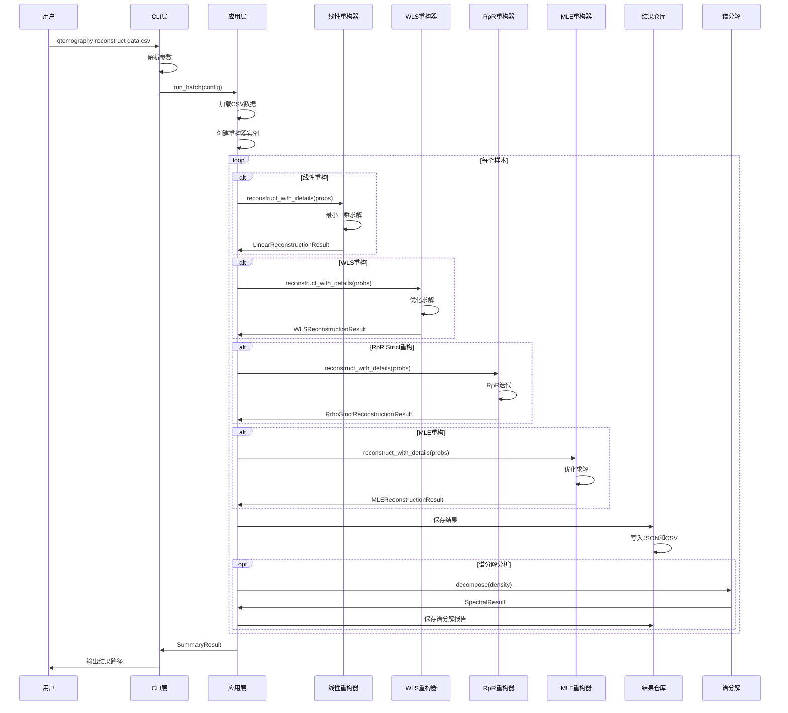

# 量子态层析重构项目代码调用流程图

> **目标**：展示代码的具体调用关系和执行顺序  
> **更新日期**: 2025年11月  
> **项目版本**: v1.0.0

---

## 🎯 **整体调用链路**

```
main() → _cmd_reconstruct() → run_batch() → controller.run_batch() → reconstruct_with_details()
```

---

## 📊 **详细调用流程图**

### **1. CLI层调用**

```mermaid
graph TD
    A[用户命令] --> B[main()]
    B --> C[build_parser()]
    C --> D[args.func(args)]
    D --> E[_cmd_reconstruct()]
    
    E --> F[参数解析]
    F --> G[构建ReconstructionConfig]
    G --> H[run_batch(config)]
    H --> I[输出结果信息]
```

**关键代码**：
```python
# qtomography/cli/main.py
def main(argv=None):
    parser = build_parser()
    args = parser.parse_args(argv)
    return args.func(args)  # 调用子命令函数

def _cmd_reconstruct(args):
    config = ReconstructionConfig(...)
    result = run_batch(config)  # 调用应用层
    return 0
```

### **2. 应用层调用**

```mermaid
graph TD
    A[run_batch(config)] --> B[ReconstructionController()]
    B --> C[controller.run_batch(config)]
    
    C --> D[加载数据]
    D --> E[创建重构器]
    E --> F[批处理循环]
    
    F --> G[线性重构]
    F --> H[WLS重构]
    F --> I[RρR Strict重构]
    F --> J[MLE重构]
    
    G --> K[保存结果]
    H --> K
    I --> K
    J --> K
    K --> L[生成汇总]
```

**关键代码**：
```python
# qtomography/app/controller.py
def run_batch(config):
    controller = ReconstructionController()
    return controller.run_batch(config)

class ReconstructionController:
    def run_batch(self, config):
        # 加载数据
        data = _load_probabilities(config.input_path, config.sheet)
        
        # 创建重构器（根据method参数）
        if "linear" in config.methods:
            linear = LinearReconstructor(dimension, design=config.design, ...)
        if "wls" in config.methods:
            wls = WLSReconstructor(dimension, design=config.design, ...)
        if "rhor_strict" in config.methods:
            rhor = RrhoStrictReconstructor(dimension, design=config.design, ...)
        if "mle" in config.methods:
            mle = MLEReconstructor(dimension, design=config.design, ...)
        
        # 批处理循环
        for idx in range(sample_count):
            probs = data[:, idx]
            
            # 根据配置选择重构方法
            if linear is not None:
                linear_result = linear.reconstruct_with_details(probs)
            if wls is not None:
                wls_result = wls.reconstruct_with_details(probs)
            if rhor is not None:
                rhor_result = rhor.reconstruct_with_details(probs)
            if mle is not None:
                mle_result = mle.reconstruct_with_details(probs)
```

### **3. 领域层调用**

#### **3.1 线性重构调用**

```mermaid
graph TD
    A[linear.reconstruct_with_details(probs)] --> B[_normalize_probabilities_grouped()]
    B --> C[projector_set.measurement_matrix]
    C --> D{是否有正则化?}
    D -->|否| E[np.linalg.lstsq()]
    D -->|是| F[岭回归求解]
    E --> G[_vec_to_density_matrix()]
    F --> G
    G --> H[DensityMatrix()]
    H --> I[LinearReconstructionResult]
```

**关键代码**：
```python
# qtomography/domain/reconstruction/linear.py
def reconstruct_with_details(self, probabilities):
    # 1. 归一化概率（按组）
    probs = self._normalize_probabilities_grouped(probabilities)
    
    # 2. 获取测量矩阵
    measurement_matrix = self.projector_set.measurement_matrix
    
    # 3. 最小二乘求解或岭回归
    if self.regularization is None:
        rho_vec, residuals, rank, singular_values = np.linalg.lstsq(
            measurement_matrix, probs, rcond=None
        )
    else:
        # 岭回归: (M^T M + λ I) rho_vec = M^T P
        mtm = measurement_matrix.T @ measurement_matrix
        rho_vec = np.linalg.solve(mtm + self.regularization * I, M.T @ probs)
    
    # 4. 重构密度矩阵
    rho_matrix = rho_vec.reshape(self.dimension, self.dimension).conj()
    
    # 5. 物理化处理
    density = DensityMatrix(rho_matrix, tolerance=self.tolerance, ...)
    
    return LinearReconstructionResult(...)
```

#### **3.2 WLS重构调用**

```mermaid
graph TD
    A[wls.reconstruct_with_details(probs)] --> B[_normalize_probabilities_grouped()]
    B --> C[_prepare_initial_density()]
    C --> D[encode_density_to_params()]
    D --> E[scipy.optimize.minimize()]
    E --> F[_objective_function()]
    F --> G[decode_params_to_density()]
    G --> H[DensityMatrix()]
    H --> I[WLSReconstructionResult]
```

**关键代码**：
```python
# qtomography/domain/reconstruction/wls.py
def reconstruct_with_details(self, probabilities, initial_density=None):
    # 1. 归一化概率
    probs = self._normalize_probabilities_grouped(probabilities)
    
    # 2. 准备初始密度矩阵
    if initial_density is None:
        initial_density = self._prepare_initial_density(probs)
    
    # 3. 参数化
    params0 = self.encode_density_to_params(initial_density)
    
    # 4. 优化求解
    res = minimize(
        fun=self._objective_function,
        x0=params0,
        args=(probs, self.projector_set.projectors, self.regularization),
        method=self.optimizer,  # L-BFGS-B
        options={"maxiter": self.max_iterations, "ftol": self.optimizer_ftol}
    )
    
    # 5. 重构密度矩阵
    rho_opt = self.decode_params_to_density(res.x)
    density = DensityMatrix(rho_opt, tolerance=self.tolerance, ...)
    
    return WLSReconstructionResult(...)
```

#### **3.3 RρR Strict重构调用**

```mermaid
graph TD
    A[rhor.reconstruct_with_details(counts_or_probs)] --> B[_normalize_per_group()]
    B --> C[_prepare_support_operators()]
    C --> D[_build_normalized_povm()]
    D --> E[_iterate_rrr_sigma()]
    E --> F[映射回ρ空间]
    F --> G[DensityMatrix()]
    G --> H[RrhoStrictReconstructionResult]
```

**关键代码**：
```python
# qtomography/domain/reconstruction/rhor_strict.py
def reconstruct_with_details(self, counts_or_probs):
    # 1. 按组归一化
    f = self._normalize_per_group(counts_or_probs)
    
    # 2. 准备支撑算符
    projectors = self.projector_set.projectors
    H = np.sum(projectors, axis=0)
    (Pi, H_sqrt, H_sqrt_inv, H_inv, support_dim, ...) = self._prepare_support_operators(H)
    
    # 3. 构建归一化POVM
    E_tilde, diagnostics = self._build_normalized_povm(projectors, US, H_sqrt_inv, support_dim)
    
    # 4. 在σ空间中执行RρR迭代
    sigma0 = np.eye(support_dim, dtype=complex) / float(support_dim)
    sigma, q, iters, converged, ll, iter_diagnostics = self._iterate_rrr_sigma(E_tilde, f, sigma0)
    
    # 5. 映射回ρ空间
    sigma_full = US @ sigma @ US.conj().T
    rho_raw = H_sqrt_inv @ sigma_full @ H_sqrt_inv
    rho_raw = rho_raw / np.real(np.trace(H_inv @ sigma_full))
    
    # 6. 物理化处理
    density = DensityMatrix(rho_raw, tolerance=self.tolerance, ...)
    
    return RrhoStrictReconstructionResult(...)
```

#### **3.4 MLE重构调用**

```mermaid
graph TD
    A[mle.reconstruct_with_details(probs)] --> B[_normalize_probabilities()]
    B --> C[_get_initial_density()]
    C --> D[_encode_density_to_params()]
    D --> E[scipy.optimize.minimize()]
    E --> F[_negative_log_likelihood()]
    F --> G[_decode_params_to_density()]
    G --> H[DensityMatrix()]
    H --> I[MLEReconstructionResult]
```

**关键代码**：
```python
# qtomography/domain/reconstruction/mle.py
def reconstruct_with_details(self, probabilities, initial_density=None):
    # 1. 归一化概率
    probs = self._normalize_probabilities(probabilities)
    
    # 2. 获取初始密度矩阵
    if initial_density is None:
        initial_density = self._get_initial_density(probs)
    
    # 3. Cholesky参数化
    params = self._encode_density_to_params(initial_density)
    
    # 4. 优化求解
    result = minimize(
        self._negative_log_likelihood,
        params,
        method='L-BFGS-B',
        jac=self._gradient
    )
    
    # 5. 重构密度矩阵
    rho = self._decode_params_to_density(result.x)
    
    # 6. 物理化处理
    density = DensityMatrix(rho, tolerance=self.tolerance, ...)
    
    return MLEReconstructionResult(...)
```

### **4. 基础设施层调用**

```mermaid
graph TD
    A[保存结果] --> B[ResultRepository.save()]
    B --> C[record.to_serializable()]
    C --> D[JSON文件保存]
    D --> E[CSV汇总更新]
    
    A --> F[谱分解分析] --> G[SpectralReporter.save()]
    G --> H[生成谱分解报告]
    
    A --> I[可视化] --> J[ReconstructionVisualizer]
    J --> K[生成图表]
    K --> L[保存PNG文件]
    
    A --> M[谱分解可视化] --> N[SpectralVisualizer]
    N --> O[生成特征值图表]
    O --> P[保存图像]
```

**关键代码**：
```python
# qtomography/infrastructure/persistence/result_repository.py
def save(self, record: ReconstructionRecord):
    payload = record.to_serializable()
    
    # 保存JSON
    with path.open("w", encoding="utf-8") as fh:
        json.dump(payload, fh, ensure_ascii=False, indent=2)
    
    # 更新CSV
    self._append_to_csv(payload)

# qtomography/infrastructure/persistence/spectral_reporter.py
def save(self, spectral_result: SpectralResult, output_path: Path):
    # 生成谱分解报告
    report = self._generate_report(spectral_result)
    report.to_csv(output_path)
```

---

## 🔄 **完整执行时序**



---

## 📁 **文件调用关系**

```
qtomography/
├── cli/
│   └── main.py                    # 入口点
│       ├── main()                 # 主函数
│       ├── _cmd_reconstruct()     # 重构命令
│       └── build_parser()         # 参数解析
├── app/
│   └── controller.py              # 应用层控制器
│       ├── run_batch()            # 批处理入口
│       └── ReconstructionController.run_batch()  # 核心逻辑
├── domain/
│   ├── reconstruction/
│   │   ├── linear.py              # 线性重构
│   │   │   └── reconstruct_with_details()  # 计算入口
│   │   ├── wls.py                 # WLS重构
│   │   │   └── reconstruct_with_details()  # 计算入口
│   │   ├── rhor_strict.py         # RρR Strict重构
│   │   │   └── reconstruct_with_details()  # 计算入口
│   │   └── mle.py                 # MLE重构
│   │       └── reconstruct_with_details()  # 计算入口
│   ├── measurement/               # 测量基设计
│   │   ├── mub.py                 # MUB测量基
│   │   ├── sic.py                 # SIC-POVM测量基
│   │   └── nopovm.py              # NoPOVM测量基
│   └── spectral_decomposition.py  # 谱分解
│       └── decompose()            # 谱分解入口
└── infrastructure/
    ├── persistence/
    │   ├── result_repository.py   # 结果持久化
    │   │   └── save()             # 保存结果
    │   └── spectral_reporter.py   # 谱分解报告
    │       └── save()             # 保存报告
    └── visualization/
        ├── reconstruction_visualizer.py  # 重构可视化
        └── spectral_visualizer.py         # 谱分解可视化
```

---

## 🎯 **关键调用点总结**

### **1. 程序入口**
```python
# 文件：qtomography/cli/main.py
def main(argv=None):
    # 解析命令行参数
    # 调用对应的子命令函数
```

### **2. 配置构建**
```python
# 文件：qtomography/cli/main.py
def _cmd_reconstruct(args):
    # 构建ReconstructionConfig对象
    # 支持method参数：linear, wls, rhor_strict, mle
    # 支持design参数：mub, sic, nopovm
    # 调用run_batch(config)
```

### **3. 批处理控制**
```python
# 文件：qtomography/app/controller.py
def run_batch(config):
    # 加载数据
    # 根据config.methods创建对应的重构器
    # 批处理循环
    # 调用重构器计算
    # 可选：执行谱分解分析
```

### **4. 计算执行**
```python
# 文件：qtomography/domain/reconstruction/linear.py
def reconstruct_with_details(self, probabilities):
    # 执行线性重构算法（支持岭回归）
    # 返回重构结果

# 文件：qtomography/domain/reconstruction/wls.py
def reconstruct_with_details(self, probabilities):
    # 执行WLS重构算法
    # 返回重构结果

# 文件：qtomography/domain/reconstruction/rhor_strict.py
def reconstruct_with_details(self, counts_or_probs):
    # 执行RρR Strict重构算法
    # 返回重构结果

# 文件：qtomography/domain/reconstruction/mle.py  
def reconstruct_with_details(self, probabilities):
    # 执行MLE重构算法
    # 返回重构结果
```

### **5. 结果保存**
```python
# 文件：qtomography/infrastructure/persistence/result_repository.py
def save(self, record):
    # 保存JSON记录
    # 更新CSV汇总

# 文件：qtomography/infrastructure/persistence/spectral_reporter.py
def save(self, spectral_result, output_path):
    # 保存谱分解报告
```

---

## 💡 **调用关系关键点**

### **1. 分层调用**
```
CLI层 → 应用层 → 领域层 → 基础设施层
```

### **2. 数据传递**
```
配置对象 → 概率向量 → 重构结果 → 记录对象 → 文件
```

### **3. 控制流**
```
主函数 → 子命令 → 批处理 → 重构计算 → 结果保存
```

### **4. 多算法支持**
```
根据config.methods动态创建重构器：
- linear: LinearReconstructor
- wls: WLSReconstructor
- rhor_strict: RrhoStrictReconstructor
- mle: MLEReconstructor
```

### **5. 测量基设计**
```
根据config.design选择测量基：
- mub: MUB测量基
- sic: SIC-POVM测量基
- nopovm: NoPOVM测量基
```

### **6. 异常处理**
```
每层都有异常处理，确保错误不会向上传播
```

---

## 🚀 **调试建议**

### **1. 设置断点位置**
```python
# 1. CLI入口
qtomography/cli/main.py:main()  # main()函数

# 2. 应用层控制
qtomography/app/controller.py  # 重构器创建和调用

# 3. 领域层计算
qtomography/domain/reconstruction/linear.py  # 最小二乘求解
qtomography/domain/reconstruction/wls.py     # WLS优化求解
qtomography/domain/reconstruction/rhor_strict.py  # RρR迭代
qtomography/domain/reconstruction/mle.py     # MLE优化求解
```

### **2. 日志输出**
```python
# 在关键位置添加日志
import logging
logger = logging.getLogger(__name__)

logger.info(f"开始处理样本 {idx}")
logger.info(f"使用重构方法: {method}")
logger.info(f"使用测量基设计: {design}")
logger.info(f"概率向量: {probs}")
logger.info(f"重构结果: {result.density.purity}")
```

### **3. 性能监控**
```python
import time

start_time = time.time()
result = reconstructor.reconstruct_with_details(probs)
elapsed = time.time() - start_time
print(f"重构耗时: {elapsed:.2f}秒")
print(f"迭代次数: {result.n_iterations if hasattr(result, 'n_iterations') else 'N/A'}")
```

---

**记住**：整个调用流程是**分层递进**的，每一层都有明确的职责。真正的计算发生在领域层的`reconstruct_with_details()`方法中！现在支持四种重构算法（Linear、WLS、RρR Strict、MLE）和三种测量基设计（MUB、SIC、NoPOVM）！
