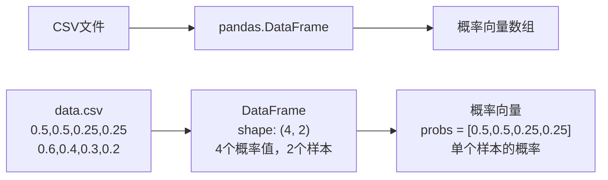
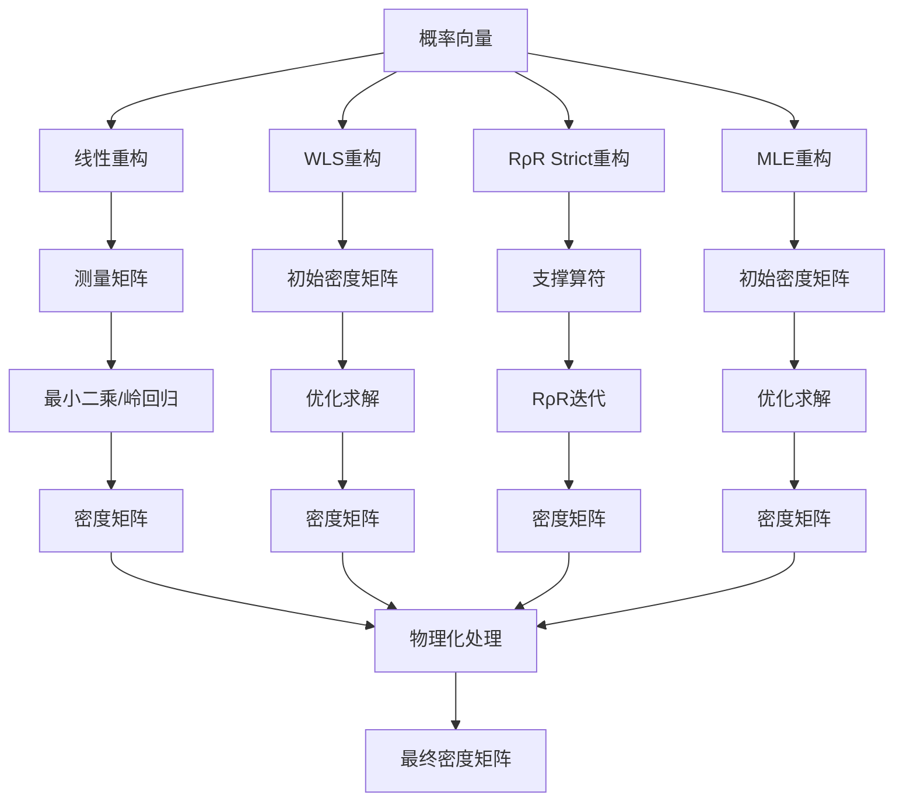
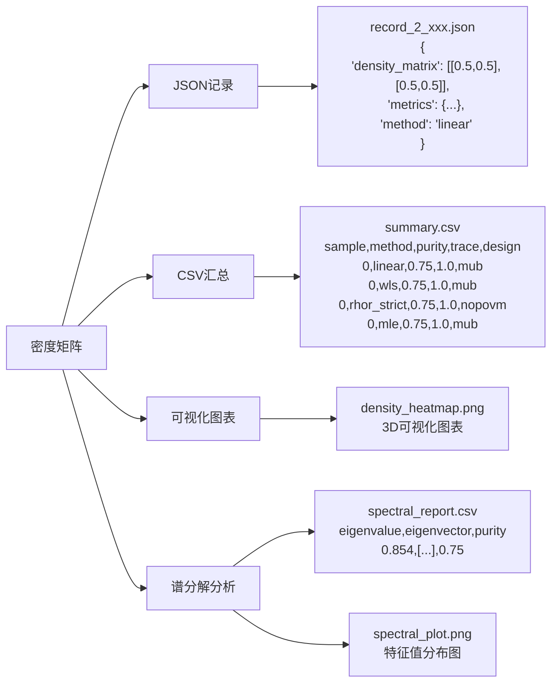

# 量子态层析重构项目数据流示意图

> **目标**：清晰展示数据在项目中的流转过程  
> **更新日期**: 2025年11月  
> **项目版本**: v1.0.0

---

## 🔄 **核心数据流**

```
用户输入 → CLI解析 → 应用层控制 → 领域层计算 → 基础设施层持久化 → 结果输出
```

---

## 📊 **详细数据转换过程**

### **阶段1：输入数据准备**



### **阶段2：重构器计算**



### **阶段3：结果输出**



---

## 🎯 **关键数据转换点**

### **1. 概率向量 → 密度矩阵**

#### **线性重构**
```python
# 输入：概率向量
probs = np.array([0.5, 0.5, 0.25, 0.25])

# 线性重构过程
measurement_matrix = projector_set.measurement_matrix  # (4, 4)
if regularization is None:
    rho_vec = np.linalg.lstsq(measurement_matrix, probs)[0]  # (4,)
else:
    # 岭回归
    rho_vec = np.linalg.solve(M.T @ M + λ*I, M.T @ probs)
rho_matrix = vec_to_density_matrix(rho_vec)  # (2, 2)

# 输出：密度矩阵
density_matrix = np.array([[0.5, 0.5], [0.5, 0.5]])
```

#### **WLS重构**
```python
# 输入：概率向量
probs = np.array([0.5, 0.5, 0.25, 0.25])

# WLS重构过程
initial_density = prepare_initial_density(probs)  # 初始密度矩阵
params0 = encode_density_to_params(initial_density)  # 参数化

# 优化求解
result = minimize(
    objective_function,  # Chi²目标函数
    params0,
    method='L-BFGS-B'
)

rho_matrix = decode_params_to_density(result.x)  # (2, 2)

# 输出：密度矩阵
density_matrix = np.array([[0.5, 0.5], [0.5, 0.5]])
```

#### **RρR Strict重构**
```python
# 输入：计数或概率向量
counts_or_probs = np.array([0.5, 0.5, 0.25, 0.25])

# RρR Strict重构过程
f = normalize_per_group(counts_or_probs)  # 按组归一化
H = np.sum(projectors, axis=0)  # H算符
E_tilde = build_normalized_povm(projectors, H)  # 归一化POVM

# RρR迭代（在σ空间）
sigma = iterate_rrr_sigma(E_tilde, f, sigma0)

# 映射回ρ空间
rho_matrix = H_sqrt_inv @ sigma @ H_sqrt_inv / Tr(H_inv @ sigma)

# 输出：密度矩阵
density_matrix = np.array([[0.5, 0.5], [0.5, 0.5]])
```

#### **MLE重构**
```python
# 输入：概率向量
probs = np.array([0.5, 0.5, 0.25, 0.25])

# MLE重构过程
initial_density = get_initial_density(probs)  # 初始密度矩阵
params = encode_density_to_params(initial_density)  # Cholesky参数化

# 优化求解
result = minimize(
    negative_log_likelihood,  # 负对数似然
    params,
    method='L-BFGS-B'
)

rho_matrix = decode_params_to_density(result.x)  # (2, 2)

# 输出：密度矩阵
density_matrix = np.array([[0.5, 0.5], [0.5, 0.5]])
```

### **2. 密度矩阵 → 物理量**

```python
# 输入：密度矩阵
density_matrix = np.array([[0.5, 0.5], [0.5, 0.5]])

# 计算物理量
purity = np.trace(density_matrix @ density_matrix)  # 0.75
trace = np.trace(density_matrix)  # 1.0
eigenvalues = np.linalg.eigvalsh(density_matrix)  # [0.146, 0.854]
rank = np.linalg.matrix_rank(density_matrix)  # 2
condition_number = np.linalg.cond(density_matrix)  # 条件数
eigenvalue_entropy = -np.sum(eigenvalues * np.log(eigenvalues + 1e-12))  # 熵

# 输出：物理量字典
metrics = {
    "purity": 0.75,
    "trace": 1.0,
    "min_eigenvalue": 0.146,
    "max_eigenvalue": 0.854,
    "rank": 2.0,
    "condition_number": 5.83,
    "eigenvalue_entropy": 0.562
}
```

### **3. 密度矩阵 → 谱分解结果**

```python
# 输入：密度矩阵
density_matrix = np.array([[0.5, 0.5], [0.5, 0.5]])

# 谱分解
eigenvalues, eigenvectors = np.linalg.eigh(density_matrix)
# eigenvalues: [0.146, 0.854]
# eigenvectors: [[-0.707, 0.707], [0.707, 0.707]]

# 输出：谱分解结果
spectral_result = {
    "eigenvalues": [0.146, 0.854],
    "eigenvectors": [[-0.707, 0.707], [0.707, 0.707]],
    "purity": 0.75,
    "rank": 2
}
```

### **4. 结果对象 → 文件**

```python
# 输入：重构结果
result = LinearReconstructionResult(
    density=density_matrix,
    residuals=residuals,
    rank=4,
    singular_values=singular_values
)

# 创建记录
record = ReconstructionRecord(
    method="linear",
    dimension=2,
    design="mub",  # 测量基设计
    probabilities=probs,
    density_matrix=density_matrix,
    metrics=metrics,
    metadata={"sample_index": 0}
)

# 输出：JSON文件
{
    "method": "linear",
    "dimension": 2,
    "design": "mub",
    "probabilities": [0.5, 0.5, 0.25, 0.25],
    "density_matrix": [[0.5, 0.5], [0.5, 0.5]],
    "metrics": {
        "purity": 0.75,
        "trace": 1.0,
        "rank": 4.0,
        "min_eigenvalue": 0.146,
        "max_eigenvalue": 0.854,
        "condition_number": 5.83,
        "eigenvalue_entropy": 0.562
    }
}
```

---

## 🚀 **完整运行流程**

### **步骤1：用户输入**
```bash
qtomography reconstruct data.csv --method linear,wls,rhor_strict,mle --dimension 4 --design mub
```

### **步骤2：数据加载**
```python
# 加载CSV文件
data = pd.read_csv("data.csv")  # shape: (16, 3)
# 16个概率值（4²），3个样本
```

### **步骤3：批处理循环**
```python
for idx in range(3):  # 3个样本
    probs = data[:, idx]  # 提取概率向量
    
    # 线性重构
    if "linear" in methods:
        linear_result = linear.reconstruct_with_details(probs)
    
    # WLS重构
    if "wls" in methods:
        wls_result = wls.reconstruct_with_details(probs)
    
    # RρR Strict重构
    if "rhor_strict" in methods:
        rhor_result = rhor.reconstruct_with_details(probs)
    
    # MLE重构
    if "mle" in methods:
        mle_result = mle.reconstruct_with_details(probs)
    
    # 保存结果
    save_record(linear_result)
    save_record(wls_result)
    save_record(rhor_result)
    save_record(mle_result)
    
    # 可选：谱分解分析
    if enable_spectral:
        spectral_result = spectral_decomposition.decompose(density)
        save_spectral_report(spectral_result)
```

### **步骤4：结果汇总**
```python
# 生成CSV汇总
summary_df = pd.DataFrame(summary_rows)
summary_df.to_csv("summary.csv")
# 包含列：sample, method, design, purity, trace, rank, condition_number, ...
```

---

## 📁 **输出文件结构**

```
demo_output/
├── records/                          # 详细记录
│   ├── record_4_2025-11-07T14-16-37.json  # 样本0线性重构
│   ├── record_4_2025-11-07T14-16-38.json  # 样本0 WLS重构
│   ├── record_4_2025-11-07T14-16-39.json  # 样本0 RρR Strict重构
│   ├── record_4_2025-11-07T14-16-40.json  # 样本0 MLE重构
│   ├── record_4_2025-11-07T14-16-41.json  # 样本1线性重构
│   └── ...
├── summary.csv                       # 汇总报告
│   # 列：sample, method, design, purity, trace, rank, 
│   #      min_eigenvalue, max_eigenvalue, condition_number,
│   #      eigenvalue_entropy, n_iterations, success
├── spectral_reports/                 # 谱分解报告
│   ├── spectral_4_2025-11-07T14-16-37.csv
│   └── ...
└── plots/                           # 可视化图表
    ├── density_heatmap_0.png
    ├── amplitude_phase_0.png
    ├── spectral_eigenvalues_0.png
    └── ...
```

---

## 💡 **数据流关键点**

### **1. 数据维度变化**
```
CSV: (16, 3) → 概率向量: (16,) → 密度矩阵: (4, 4)
```

### **2. 数据类型转换**
```
字符串 → 浮点数 → 复数矩阵 → JSON字符串
```

### **3. 数据流向**
```
文件 → 内存 → 计算 → 内存 → 文件
```

### **4. 数据验证**
```
输入验证 → 计算验证 → 物理约束验证 → 输出验证
```

### **5. 多算法数据流**
```
同一概率向量 → 不同重构算法 → 不同密度矩阵 → 对比分析
```

### **6. 测量基设计影响**
```
不同测量基设计（MUB/SIC/NoPOVM）→ 不同测量矩阵 → 不同重构结果
```

---

## 🎯 **总结**

**数据流核心**：
1. **输入**：CSV概率数据（支持多种测量基设计）
2. **处理**：多种重构算法计算（Linear/WLS/RρR Strict/MLE）
3. **输出**：JSON记录 + CSV汇总 + 谱分解报告

**关键转换**：
- 概率向量 → 密度矩阵（四种算法）
- 密度矩阵 → 物理量（扩展指标）
- 密度矩阵 → 谱分解结果
- 结果对象 → 文件格式

**流程控制**：
- CLI层：参数解析（支持method和design参数）
- 应用层：批处理控制（多算法支持）
- 领域层：算法计算（四种重构算法）
- 基础设施层：结果持久化（JSON/CSV/谱分解报告）

**新增特性**：
- ✅ 支持四种重构算法（Linear、WLS、RρR Strict、MLE）
- ✅ 支持三种测量基设计（MUB、SIC、NoPOVM）
- ✅ 扩展的物理量指标（rank、condition_number、eigenvalue_entropy等）
- ✅ 谱分解分析和报告生成

记住：**数据在每一层都会发生转换，但核心的计算逻辑在领域层的重构器中！现在支持多种算法和测量基设计的灵活组合！**
