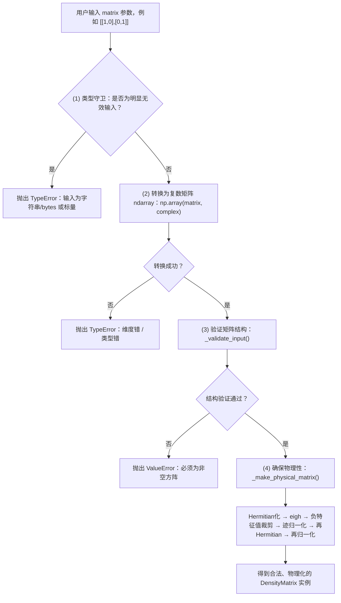

太好了 👍 我来给你画一张 **`DensityMatrix` 初始化输入检查流程图**，
 让你直观地看到从外部传入 `matrix` 到最终变成可用的物理密度矩阵之间的完整验证逻辑。

------

# 🧭 **`DensityMatrix.__init__()` 输入检查流程图**




------

## 🔍 **流程总结**

| 阶段           | 检查目标                     | 检查手段                     | 抛出异常类型 | 目的             |
| -------------- | ---------------------------- | ---------------------------- | ------------ | ---------------- |
| (1) 类型守卫   | 检查是不是明显错误类型       | `isinstance` / `np.isscalar` | `TypeError`  | 提前拒绝         |
| (2) 尝试数组化 | 检查是否能转为复数数组       | `np.array(matrix, complex)`  | `TypeError`  | 保证统一类型     |
| (3) 结构验证   | 检查矩阵维度、方阵性         | `_validate_input()`          | `ValueError` | 确保数学意义正确 |
| (4) 物理化     | 保证 Hermitian、正定、归一化 | `_make_physical_matrix()`    | —            | 确保物理正确     |

------

## 💬 一句话记忆

> `DensityMatrix` 初始化分四步：
>
> - **类型守卫** → 拒绝奇怪输入；
> - **数组化** → 转为统一 numpy 格式；
> - **结构验证** → 确保是方阵；
> - **物理化** → 修正为合法密度矩阵。

------

是否希望我接着帮你画一张 **`DensityMatrix.ensure_physical()` 内部逻辑图**？
 那是 `_make_physical_matrix()` 的更细节层次，会展示特征值分解、负值裁剪、归一化的全过程。


太好啦～下面给你把 **`ensure_physical()` / `_make_physical_matrix()`** 的内部逻辑完整画出来，并补充关键数学步骤、数值稳定性要点与边界情况处理。

------

# 🧭 `ensure_physical()` / `_make_physical_matrix()` 流程图

```
                 ┌─────────────────────────────────────┐
                 │ 输入：候选密度矩阵 ρ_in (复杂度 n×n) │
                 └─────────────────────┬───────────────┘
                                       │
                                       ▼
        ┌────────────────────────────────────────────────────┐
        │ 1) Hermitian 化（压回厄米子空间，抑制数值噪声）       │
        │    ρ₀ = (ρ_in + ρ_in^†)/2                          │
        └────────────────────────────────────────────────────┘
                                       │
                                       ▼
        ┌────────────────────────────────────────────────────┐
        │ 2) 特征值分解（Hermitian专用稳定算法）               │
        │    [V, λ] = eigh(ρ₀),  ρ₀ = V·diag(λ)·V^†          │
        └────────────────────────────────────────────────────┘
                                       │
                                       ▼
        ┌────────────────────────────────────────────────────┐
        │ 3) 负特征值裁剪（数值容差 tol）                      │
        │    λ' = max(λ, 0)  (更精确地：λ'<tol → 0)           │
        │    tol = max(self.tolerance, 1e-12)                │
        └────────────────────────────────────────────────────┘
                                       │
                                       ▼
        ┌────────────────────────────────────────────────────┐
        │ 4) 归一化迹（Tr(ρ)=1）                              │
        │    s = Σ λ'                                         │
        │    若 s ≤ tol → λ' = 1/n（退化为最大混合态）         │
        │    否则 λ'' = λ'/s                                  │
        └────────────────────────────────────────────────────┘
                                       │
                                       ▼
        ┌────────────────────────────────────────────────────┐
        │ 5) 重构密度矩阵并再 Hermitian 化（双保险）           │
        │    ρ₁ = V·diag(λ'')·V^†                            │
        │    ρ₁ ← (ρ₁ + ρ₁^†)/2                              │
        └────────────────────────────────────────────────────┘
                                       │
                                       ▼
        ┌────────────────────────────────────────────────────┐
        │ 6) 再归一化（抹平乘法漂移）                          │
        │    t = Re Tr(ρ₁)                                    │
        │    若 t ≤ 0 → ρ_out = I/n                           │
        │    否则 ρ_out = ρ₁ / t                              │
        └────────────────────────────────────────────────────┘
                                       │
                                       ▼
                 ┌─────────────────────────────────────┐
                 │ 输出：物理化密度矩阵 ρ_out          │
                 │ 满足：Hermitian、PSD、Tr(ρ)=1       │
                 └─────────────────────────────────────┘
```

------

## ✏️ 关键数学与数值要点

1. **Hermitian投影**
    [
    \rho_0=\frac{\rho_{\text{in}}+\rho_{\text{in}}^\dagger}{2}
    ]
    把任何非厄米的数值噪声拉回厄米空间；否则 `eigh` 不稳定。
2. **正半定性（PSD）修复**

- 对本征值 (\lambda_i) 进行裁剪：(\lambda'_i = \max(\lambda_i,0))；
- 实际实现里会用容差：若 (\lambda_i < \text{tol}) 则置 0，避免 (-10^{-16}) 级“假负值”。

1. **迹归一化**

- 若 (\sum \lambda'_i \le \text{tol})：说明近乎全零（或噪声导致全被裁剪），回退为最大混合态 (\frac{I}{n})；
- 否则按和归一：(\lambda''_i=\lambda'_i/\sum \lambda'_i)。

1. **双重保险**

- 重构后**再 Hermitian 一次**并**再归一化一次**，对抗浮点堆叠误差（乘法、对角化重构都会有 1e-12 级漂移）。

------

## 🧪 边界/异常情况如何处理

| 情况                         | 现象       | 处理策略                                       |
| ---------------------------- | ---------- | ---------------------------------------------- |
| 极小负特征值（如 -1e-15）    | 浮点噪声   | 用 `tol = max(self.tolerance, 1e-12)` 裁剪为 0 |
| 所有特征值被裁到 0           | `trace≈0`  | 退化为最大混合态 (I/n)                         |
| 重构后 `Tr(ρ)` 非 1          | 浮点漂移   | 再归一化：`ρ ← ρ / Re Tr(ρ)`                   |
| Re Tr(ρ) ≤ 0（极端数值错误） | 不物理     | 回退 `ρ = I/n`                                 |
| 输入非 Hermitian             | 数值不稳定 | 第 1 步先 Hermitian 化                         |

------

## 🧩 伪代码（与你代码的等价表达）

```python
def make_physical(rho_in, tol_user=1e-10):
    tol = max(tol_user, 1e-12)

    # 1) Hermitian 化
    rho0 = (rho_in + rho_in.conj().T) / 2

    # 2) eigh 分解（Hermitian稳定）
    eigvals, eigvecs = eigh(rho0)
    eigvals = np.real(eigvals)

    # 3) 负值裁剪（带容差）
    eigvals = np.where(eigvals < tol, 0.0, eigvals)

    # 4) 迹归一化
    s = eigvals.sum()
    if s <= tol:
        eigvals = np.ones_like(eigvals) / len(eigvals)
    else:
        eigvals = eigvals / s

    # 5) 重构 & 再 Hermitian
    rho1 = eigvecs @ np.diag(eigvals) @ eigvecs.conj().T
    rho1 = (rho1 + rho1.conj().T) / 2

    # 6) 再归一化（防漂移）
    t = float(np.real(np.trace(rho1)))
    if t <= 0:
        return np.eye(len(eigvals)) / len(eigvals)
    return rho1 / t
```

------

## ⏱️ 复杂度与稳定性

- **时间复杂度**：主导为 `eigh`，(O(n^3))。
- **数值稳定**：
  - Hermitian 化 + Hermitian 专用 `eigh`；
  - 以 `tol` 裁剪极小负特征值；
  - 两次归一化消除乘法/重构漂移；
  - 极端情况下回退到 (I/n)。

------

## 🎛️ 实战调参建议

- `self.tolerance` 设得太小（如 `<1e-12`）可能把 (-10^{-14}) 的噪声暴露出来；
- 设得太大（如 `>1e-6`）会把真实的小概率本征值“钳死”为 0；
- **建议**：一般取 `1e-10 ~ 1e-9`，并强制 `tol = max(user_tol, 1e-12)` 作为下限。

------

如果你愿意，我可以把这个流程图和注释整理到你项目的 `docs/` 或者补到 `density.py` 的模块级 docstring 里，顺带加一两个 “单元测试样例” (如：有微负特征值的矩阵 / 病态近纯态)。要不要我直接给你测试用例模板？