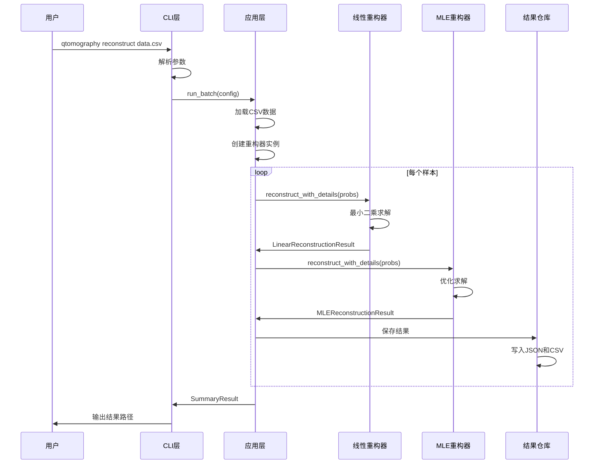

# 量子态层析重构项目代码调用流程图

> **目标**：展示代码的具体调用关系和执行顺序

---

## 🎯 **整体调用链路**

```
main() → _cmd_reconstruct() → run_batch() → controller.run_batch() → reconstruct_with_details()
```

---

## 📊 **详细调用流程图**

### **1. CLI层调用**

```mermaid
graph TD
    A[用户命令] --> B[main()]
    B --> C[build_parser()]
    C --> D[args.func(args)]
    D --> E[_cmd_reconstruct()]
    
    E --> F[参数解析]
    F --> G[构建ReconstructionConfig]
    G --> H[run_batch(config)]
    H --> I[输出结果信息]
```

**关键代码**：
```python
# qtomography/cli/main.py
def main(argv=None):
    parser = build_parser()
    args = parser.parse_args(argv)
    return args.func(args)  # 调用子命令函数

def _cmd_reconstruct(args):
    config = ReconstructionConfig(...)
    result = run_batch(config)  # 调用应用层
    return 0
```

### **2. 应用层调用**

```mermaid
graph TD
    A[run_batch(config)] --> B[ReconstructionController()]
    B --> C[controller.run_batch(config)]
    
    C --> D[加载数据]
    D --> E[创建重构器]
    E --> F[批处理循环]
    
    F --> G[线性重构]
    F --> H[MLE重构]
    
    G --> I[保存结果]
    H --> I
    I --> J[生成汇总]
```

**关键代码**：
```python
# qtomography/app/controller.py
def run_batch(config):
    controller = ReconstructionController()
    return controller.run_batch(config)

class ReconstructionController:
    def run_batch(self, config):
        # 加载数据
        data = _load_probabilities(config.input_path, config.sheet)
        
        # 创建重构器
        linear = LinearReconstructor(dimension, ...)
        mle = MLEReconstructor(dimension, ...)
        
        # 批处理循环
        for idx in range(sample_count):
            probs = data[:, idx]
            
            # 线性重构
            if linear is not None:
                linear_result = linear.reconstruct_with_details(probs)
            
            # MLE重构
            if mle is not None:
                mle_result = mle.reconstruct_with_details(probs)
```

### **3. 领域层调用**

#### **3.1 线性重构调用**

```mermaid
graph TD
    A[linear.reconstruct_with_details(probs)] --> B[_normalize_probabilities()]
    B --> C[projector_set.measurement_matrix]
    C --> D[np.linalg.lstsq()]
    D --> E[_vec_to_density_matrix()]
    E --> F[density.sanitize_within_tol()]
    F --> G[LinearReconstructionResult]
```

**关键代码**：
```python
# qtomography/domain/reconstruction/linear.py
def reconstruct_with_details(self, probabilities):
    # 1. 归一化概率
    probs = self._normalize_probabilities(probabilities)
    
    # 2. 获取测量矩阵
    measurement_matrix = self.projector_set.measurement_matrix
    
    # 3. 最小二乘求解
    rho_vec, residuals, rank, singular_values = np.linalg.lstsq(
        measurement_matrix, probs, rcond=None
    )
    
    # 4. 重构密度矩阵
    rho = self._vec_to_density_matrix(rho_vec)
    
    # 5. 物理化处理
    rho_physical = rho.sanitize_within_tol()
    
    return LinearReconstructionResult(...)
```

#### **3.2 MLE重构调用**

```mermaid
graph TD
    A[mle.reconstruct_with_details(probs)] --> B[_normalize_probabilities()]
    B --> C[_get_initial_density()]
    C --> D[_encode_density_to_params()]
    D --> E[scipy.optimize.minimize()]
    E --> F[_decode_params_to_density()]
    F --> G[density.sanitize_within_tol()]
    G --> H[MLEReconstructionResult]
```

**关键代码**：
```python
# qtomography/domain/reconstruction/mle.py
def reconstruct_with_details(self, probabilities, initial_density=None):
    # 1. 归一化概率
    probs = self._normalize_probabilities(probabilities)
    
    # 2. 获取初始密度矩阵
    if initial_density is None:
        initial_density = self._get_initial_density(probs)
    
    # 3. 参数化
    params = self._encode_density_to_params(initial_density)
    
    # 4. 优化求解
    result = minimize(
        self._negative_log_likelihood,
        params,
        method='L-BFGS-B',
        jac=self._gradient
    )
    
    # 5. 重构密度矩阵
    rho = self._decode_params_to_density(result.x)
    
    # 6. 物理化处理
    rho_physical = rho.sanitize_within_tol()
    
    return MLEReconstructionResult(...)
```

### **4. 基础设施层调用**

```mermaid
graph TD
    A[保存结果] --> B[ResultRepository.save()]
    B --> C[record.to_serializable()]
    C --> D[JSON文件保存]
    D --> E[CSV汇总更新]
    
    A --> F[可视化] --> G[ReconstructionVisualizer]
    G --> H[生成图表]
    H --> I[保存PNG文件]
```

**关键代码**：
```python
# qtomography/infrastructure/persistence/result_repository.py
def save(self, record: ReconstructionRecord):
    payload = record.to_serializable()
    
    # 保存JSON
    with path.open("w", encoding="utf-8") as fh:
        json.dump(payload, fh, ensure_ascii=False, indent=2)
    
    # 更新CSV
    self._append_to_csv(payload)
```

---

## 🔄 **完整执行时序**



---

## 📁 **文件调用关系**

```
qtomography/
├── cli/
│   └── main.py                    # 入口点
│       ├── main()                 # 主函数
│       ├── _cmd_reconstruct()     # 重构命令
│       └── build_parser()         # 参数解析
├── app/
│   └── controller.py              # 应用层控制器
│       ├── run_batch()            # 批处理入口
│       └── ReconstructionController.run_batch()  # 核心逻辑
├── domain/
│   └── reconstruction/
│       ├── linear.py              # 线性重构
│       │   └── reconstruct_with_details()  # 计算入口
│       └── mle.py                 # MLE重构
│           └── reconstruct_with_details()  # 计算入口
└── infrastructure/
    └── persistence/
        └── result_repository.py   # 结果持久化
            └── save()             # 保存结果
```

---

## 🎯 **关键调用点总结**

### **1. 程序入口**
```python
# 文件：qtomography/cli/main.py
def main(argv=None):
    # 解析命令行参数
    # 调用对应的子命令函数
```

### **2. 配置构建**
```python
# 文件：qtomography/cli/main.py
def _cmd_reconstruct(args):
    # 构建ReconstructionConfig对象
    # 调用run_batch(config)
```

### **3. 批处理控制**
```python
# 文件：qtomography/app/controller.py
def run_batch(config):
    # 加载数据
    # 创建重构器
    # 批处理循环
    # 调用重构器计算
```

### **4. 计算执行**
```python
# 文件：qtomography/domain/reconstruction/linear.py
def reconstruct_with_details(self, probabilities):
    # 执行线性重构算法
    # 返回重构结果

# 文件：qtomography/domain/reconstruction/mle.py  
def reconstruct_with_details(self, probabilities):
    # 执行MLE重构算法
    # 返回重构结果
```

### **5. 结果保存**
```python
# 文件：qtomography/infrastructure/persistence/result_repository.py
def save(self, record):
    # 保存JSON记录
    # 更新CSV汇总
```

---

## 💡 **调用关系关键点**

### **1. 分层调用**
```
CLI层 → 应用层 → 领域层 → 基础设施层
```

### **2. 数据传递**
```
配置对象 → 概率向量 → 重构结果 → 记录对象 → 文件
```

### **3. 控制流**
```
主函数 → 子命令 → 批处理 → 重构计算 → 结果保存
```

### **4. 异常处理**
```
每层都有异常处理，确保错误不会向上传播
```

---

## 🚀 **调试建议**

### **1. 设置断点位置**
```python
# 1. CLI入口
qtomography/cli/main.py:196  # main()函数

# 2. 应用层控制
qtomography/app/controller.py:700  # 线性重构调用
qtomography/app/controller.py:849  # MLE重构调用

# 3. 领域层计算
qtomography/domain/reconstruction/linear.py:86  # 最小二乘求解
qtomography/domain/reconstruction/mle.py:120   # 优化求解
```

### **2. 日志输出**
```python
# 在关键位置添加日志
import logging
logger = logging.getLogger(__name__)

logger.info(f"开始处理样本 {idx}")
logger.info(f"概率向量: {probs}")
logger.info(f"重构结果: {result.density.purity}")
```

### **3. 性能监控**
```python
import time

start_time = time.time()
result = reconstructor.reconstruct_with_details(probs)
elapsed = time.time() - start_time
print(f"重构耗时: {elapsed:.2f}秒")
```

---

**记住**：整个调用流程是**分层递进**的，每一层都有明确的职责。真正的计算发生在领域层的`reconstruct_with_details()`方法中！
