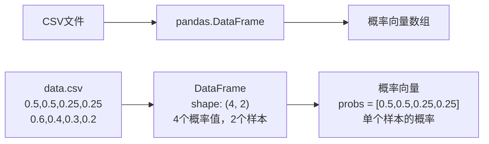
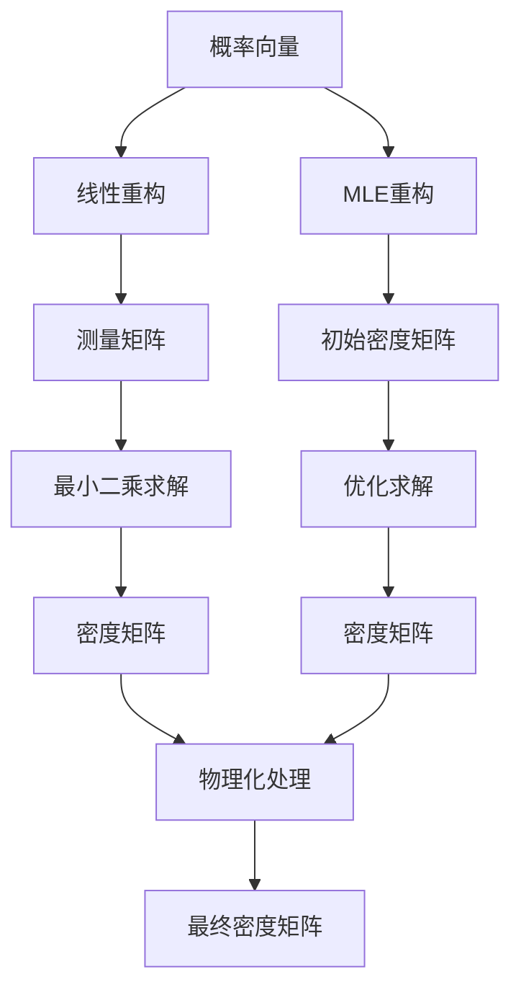
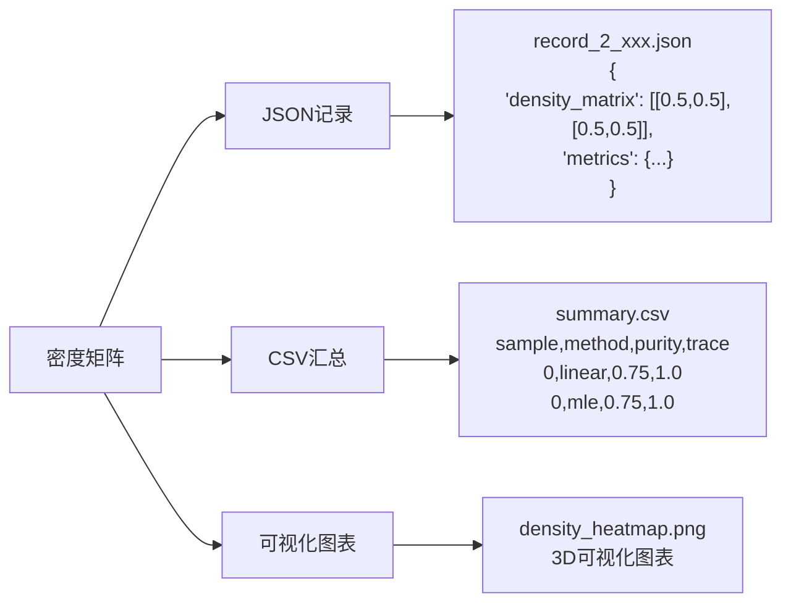

# 量子态层析重构项目数据流示意图

> **目标**：清晰展示数据在项目中的流转过程

---

## 🔄 **核心数据流**

```
用户输入 → CLI解析 → 应用层控制 → 领域层计算 → 基础设施层持久化 → 结果输出
```

---

## 📊 **详细数据转换过程**

### **阶段1：输入数据准备**



### **阶段2：重构器计算**



### **阶段3：结果输出**



---

## 🎯 **关键数据转换点**

### **1. 概率向量 → 密度矩阵**

```python
# 输入：概率向量
probs = np.array([0.5, 0.5, 0.25, 0.25])

# 线性重构过程
measurement_matrix = projector_set.measurement_matrix  # (4, 4)
rho_vec = np.linalg.lstsq(measurement_matrix, probs)[0]  # (4,)
rho_matrix = vec_to_density_matrix(rho_vec)  # (2, 2)

# 输出：密度矩阵
density_matrix = np.array([[0.5, 0.5], [0.5, 0.5]])
```

### **2. 密度矩阵 → 物理量**

```python
# 输入：密度矩阵
density_matrix = np.array([[0.5, 0.5], [0.5, 0.5]])

# 计算物理量
purity = np.trace(density_matrix @ density_matrix)  # 0.75
trace = np.trace(density_matrix)  # 1.0
eigenvalues = np.linalg.eigvals(density_matrix)  # [0.146, 0.854]

# 输出：物理量字典
metrics = {
    "purity": 0.75,
    "trace": 1.0,
    "min_eigenvalue": 0.146,
    "max_eigenvalue": 0.854
}
```

### **3. 结果对象 → 文件**

```python
# 输入：重构结果
result = LinearReconstructionResult(
    density=density_matrix,
    residuals=residuals,
    rank=4,
    singular_values=singular_values
)

# 创建记录
record = ReconstructionRecord(
    method="linear",
    dimension=2,
    probabilities=probs,
    density_matrix=density_matrix,
    metrics=metrics,
    metadata={"sample_index": 0}
)

# 输出：JSON文件
{
    "method": "linear",
    "dimension": 2,
    "probabilities": [0.5, 0.5, 0.25, 0.25],
    "density_matrix": [[0.5, 0.5], [0.5, 0.5]],
    "metrics": {
        "purity": 0.75,
        "trace": 1.0,
        "rank": 4.0,
        "min_eigenvalue": 0.146,
        "max_eigenvalue": 0.854
    }
}
```

---

## 🚀 **完整运行流程**

### **步骤1：用户输入**
```bash
qtomography reconstruct data.csv --method both --dimension 4
```

### **步骤2：数据加载**
```python
# 加载CSV文件
data = pd.read_csv("data.csv")  # shape: (4, 3)
# 4个概率值，3个样本
```

### **步骤3：批处理循环**
```python
for idx in range(3):  # 3个样本
    probs = data[:, idx]  # 提取概率向量
    
    # 线性重构
    linear_result = linear.reconstruct_with_details(probs)
    
    # MLE重构
    mle_result = mle.reconstruct_with_details(probs)
    
    # 保存结果
    save_record(linear_result)
    save_record(mle_result)
```

### **步骤4：结果汇总**
```python
# 生成CSV汇总
summary_df = pd.DataFrame(summary_rows)
summary_df.to_csv("summary.csv")
```

---

## 📁 **输出文件结构**

```
demo_output/
├── records/                          # 详细记录
│   ├── record_2_2025-10-07T14-16-37.json  # 样本0线性重构
│   ├── record_2_2025-10-07T14-16-38.json  # 样本0 MLE重构
│   ├── record_2_2025-10-07T14-16-39.json  # 样本1线性重构
│   └── record_2_2025-10-07T14-16-40.json  # 样本1 MLE重构
├── summary.csv                       # 汇总报告
└── plots/                           # 可视化图表
    ├── density_heatmap_0.png
    ├── amplitude_phase_0.png
    └── ...
```

---

## 💡 **数据流关键点**

### **1. 数据维度变化**
```
CSV: (4, 3) → 概率向量: (4,) → 密度矩阵: (2, 2)
```

### **2. 数据类型转换**
```
字符串 → 浮点数 → 复数矩阵 → JSON字符串
```

### **3. 数据流向**
```
文件 → 内存 → 计算 → 内存 → 文件
```

### **4. 数据验证**
```
输入验证 → 计算验证 → 物理约束验证 → 输出验证
```

---

## 🎯 **总结**

**数据流核心**：
1. **输入**：CSV概率数据
2. **处理**：重构算法计算
3. **输出**：JSON记录 + CSV汇总

**关键转换**：
- 概率向量 → 密度矩阵
- 密度矩阵 → 物理量
- 结果对象 → 文件格式

**流程控制**：
- CLI层：参数解析
- 应用层：批处理控制
- 领域层：算法计算
- 基础设施层：结果持久化

记住：**数据在每一层都会发生转换，但核心的计算逻辑在领域层的重构器中！**
