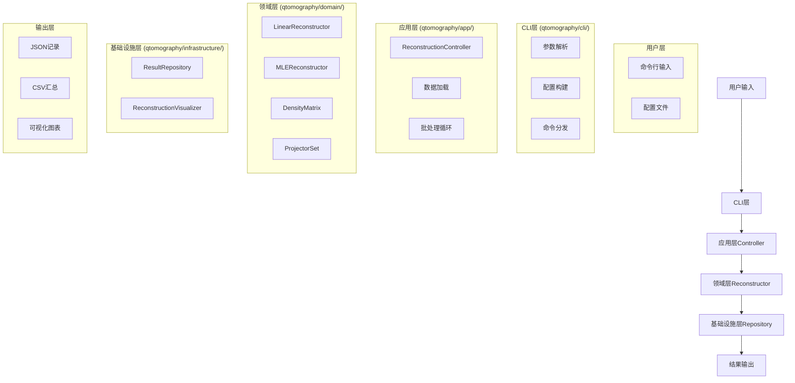
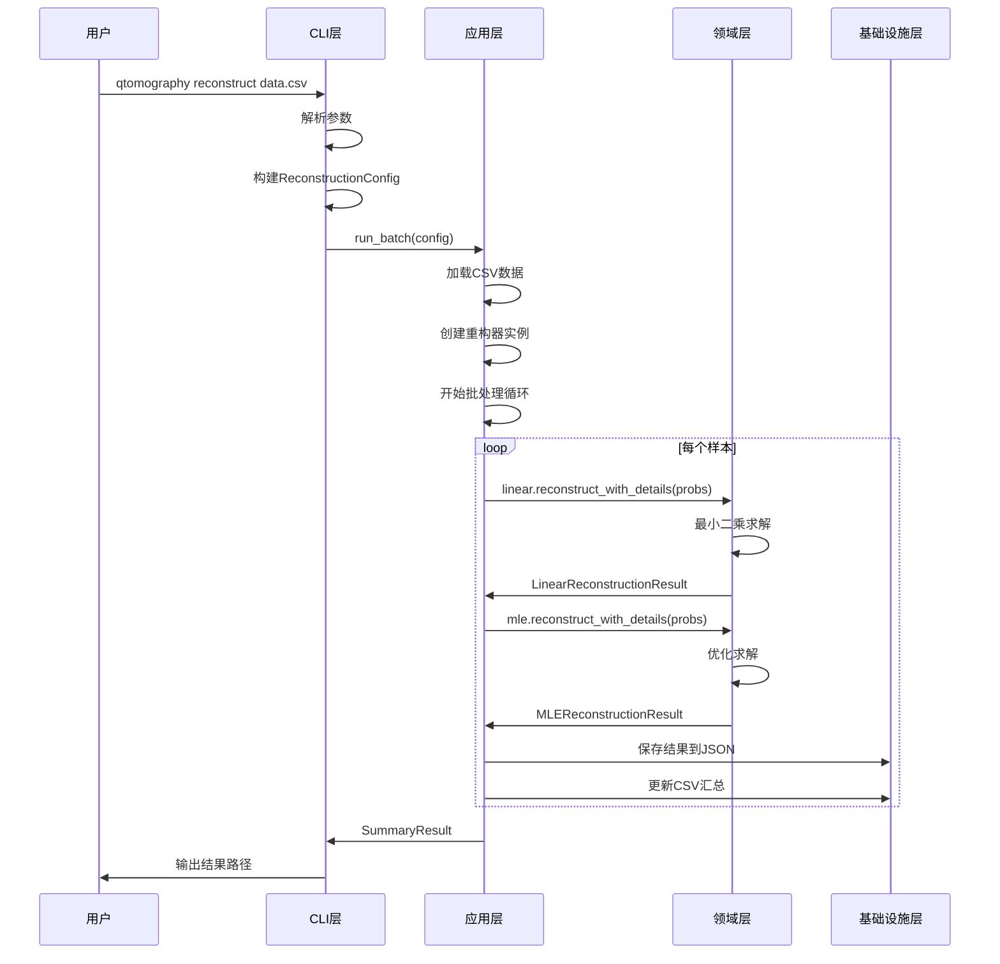

# 量子态层析重构项目运行流程详解

> **目标**：理清项目的数据流和运行流程，从用户输入到最终结果输出

---

## 🎯 **整体架构流程**



---

## 📊 **详细数据流程图**

### **1. 用户输入阶段**

```bash
# 用户命令示例
qtomography reconstruct data.csv --method both --dimension 4 --bell
```

**输入数据格式**：
```csv
# data.csv 示例
0.5,0.5,0.25,0.25
0.6,0.4,0.3,0.2
0.7,0.3,0.35,0.15
```

**数据含义**：
- 每行：一个量子态的测量概率
- 每列：不同测量基下的概率
- 维度：4维 → 2×2密度矩阵

---

### **2. CLI层处理流程**

```python
# qtomography/cli/main.py
def _cmd_reconstruct(args):
    # [1] 参数解析和验证
    input_path = Path(args.input)
    methods = _resolve_methods(args.method)  # "both" → ["linear", "mle"]
    dimension = args.dimension
    
    # [2] 构建配置对象
    config = ReconstructionConfig(
        input_path=input_path,
        output_dir=Path("demo_output"),
        methods=methods,
        dimension=dimension,
        analyze_bell=args.bell,
        # ... 其他参数
    )
    
    # [3] 调用应用层
    result = run_batch(config)
    
    # [4] 输出结果信息
    print(f"汇总报告: {result.summary_path}")
    print(f"详细记录: {result.records_dir}")
```

**数据转换**：
```
命令行参数 → ReconstructionConfig对象
```

---

### **3. 应用层控制器流程**

```python
# qtomography/app/controller.py
def run_batch(config: ReconstructionConfig):
    # [1] 数据加载
    data = _load_probabilities(config.input_path, config.sheet)
    # data.shape = (4, 3)  # 4个概率值，3个样本
    
    # [2] 维度推断
    dimension = config.dimension or _infer_dimension(data.shape[0])
    # dimension = 2  # 4个概率 → 2×2矩阵
    
    # [3] 创建重构器实例
    linear = LinearReconstructor(dimension, tolerance=1e-9)
    mle = MLEReconstructor(dimension, tolerance=1e-9)
    
    # [4] 批处理循环
    for idx in range(data.shape[1]):  # 遍历每个样本
        probs = data[:, idx]  # 提取当前样本的概率向量
        
        # 线性重构
        if "linear" in config.methods:
            linear_result = linear.reconstruct_with_details(probs)
            # 保存结果到JSON和CSV
        
        # MLE重构
        if "mle" in config.methods:
            mle_result = mle.reconstruct_with_details(probs)
            # 保存结果到JSON和CSV
    
    # [5] 生成汇总报告
    return SummaryResult(...)
```

**数据流**：
```
CSV文件 → pandas.DataFrame → 概率向量 → 重构结果 → JSON/CSV文件
```

---

### **4. 领域层计算流程**

#### **4.1 线性重构计算**

```python
# qtomography/domain/reconstruction/linear.py
def reconstruct_with_details(self, probabilities):
    # [1] 数据预处理
    probs = self._normalize_probabilities(probabilities)
    # probs = [0.5, 0.5, 0.25, 0.25] 归一化后
    
    # [2] 获取测量矩阵
    measurement_matrix = self.projector_set.measurement_matrix
    # measurement_matrix.shape = (4, 4)  # 4个测量基，4个密度矩阵元素
    
    # [3] 最小二乘求解
    if self.regularization is None:
        rho_vec, residuals, rank, singular_values = np.linalg.lstsq(
            measurement_matrix, probs, rcond=None
        )
    else:
        # 岭回归求解
        rho_vec = np.linalg.solve(mtm + lambda_eye, right_hand)
    
    # [4] 重构密度矩阵
    rho = self._vec_to_density_matrix(rho_vec)
    # rho.shape = (2, 2)  # 2×2密度矩阵
    
    # [5] 物理化处理
    rho_physical = rho.sanitize_within_tol()
    
    return LinearReconstructionResult(
        density=rho_physical,
        residuals=residuals,
        rank=rank,
        singular_values=singular_values
    )
```

**数据转换**：
```
概率向量 [0.5,0.5,0.25,0.25] → 密度矩阵 [[0.5,0.5],[0.5,0.5]]
```

#### **4.2 MLE重构计算**

```python
# qtomography/domain/reconstruction/mle.py
def reconstruct_with_details(self, probabilities, initial_density=None):
    # [1] 数据预处理
    probs = self._normalize_probabilities(probabilities)
    
    # [2] 获取初始密度矩阵
    if initial_density is None:
        initial_density = self._get_initial_density(probs)
        # 通常使用线性重构结果作为初始值
    
    # [3] 参数化密度矩阵
    params = self._encode_density_to_params(initial_density)
    
    # [4] 优化求解
    result = minimize(
        self._negative_log_likelihood,
        params,
        method='L-BFGS-B',
        jac=self._gradient,
        options={'maxiter': self.max_iterations}
    )
    
    # [5] 重构密度矩阵
    rho = self._decode_params_to_density(result.x)
    
    # [6] 物理化处理
    rho_physical = rho.sanitize_within_tol()
    
    return MLEReconstructionResult(
        density=rho_physical,
        iterations=result.nit,
        success=result.success,
        final_objective=result.fun
    )
```

**数据转换**：
```
概率向量 → 初始密度矩阵 → 优化参数 → 最终密度矩阵
```

---

### **5. 基础设施层持久化流程**

```python
# qtomography/infrastructure/persistence/result_repository.py
def save(self, record: ReconstructionRecord):
    # [1] 序列化记录
    payload = record.to_serializable()
    
    # [2] 保存JSON文件
    with path.open("w", encoding="utf-8") as fh:
        json.dump(payload, fh, ensure_ascii=False, indent=2)
    
    # [3] 更新CSV汇总
    self._append_to_csv(payload)
```

**数据格式**：
```json
// record_2_2025-10-07T14-16-37.json
{
  "method": "linear",
  "dimension": 2,
  "probabilities": [0.5, 0.5, 0.25, 0.25],
  "density_matrix": [[0.5, 0.5], [0.5, 0.5]],
  "metrics": {
    "purity": 0.75,
    "trace": 1.0,
    "rank": 4.0,
    "min_eigenvalue": 0.146,
    "max_eigenvalue": 0.854
  }
}
```

---

## 🔄 **完整运行流程时序图**



---

## 📁 **文件输出结构**

```
demo_output/
├── records/                          # 详细记录目录
│   ├── record_2_2025-10-07T14-16-37.json  # 线性重构结果
│   ├── record_2_2025-10-07T14-16-38.json  # MLE重构结果
│   └── ...
├── summary.csv                       # 汇总报告
└── plots/                           # 可视化图表（可选）
    ├── density_heatmap_0.png
    ├── amplitude_phase_0.png
    └── ...
```

**summary.csv内容**：
```csv
sample,method,purity,trace,rank,min_eigenvalue,max_eigenvalue,...
0,linear,0.75,1.0,4.0,0.146,0.854,...
0,mle,0.75,1.0,4.0,0.146,0.854,...
1,linear,0.80,1.0,4.0,0.150,0.850,...
1,mle,0.81,1.0,4.0,0.151,0.849,...
```

---

## 🎯 **关键数据转换点**

### **1. 输入数据转换**
```
CSV文件 → pandas.DataFrame → 概率向量数组
```

### **2. 重构计算转换**
```
概率向量 → 测量矩阵 → 密度矩阵向量 → 密度矩阵
```

### **3. 结果输出转换**
```
重构结果 → ReconstructionRecord → JSON文件 + CSV汇总
```

### **4. 可视化转换**
```
密度矩阵 → 热图/3D图 → PNG文件
```

---

## 💡 **流程关键点总结**

### **1. 数据流向**
```
用户输入 → CLI解析 → 应用层控制 → 领域层计算 → 基础设施层持久化 → 结果输出
```

### **2. 计算启动点**
- **文件**：`qtomography/app/controller.py`
- **方法**：`run_batch()` 中的循环
- **关键调用**：`reconstruct_with_details(probs)`

### **3. 核心算法**
- **线性重构**：`np.linalg.lstsq()` 最小二乘求解
- **MLE重构**：`scipy.optimize.minimize()` 优化求解

### **4. 结果存储**
- **JSON**：详细记录，包含完整信息
- **CSV**：汇总报告，便于分析

---

## 🚀 **运行示例**

### **命令行执行**
```bash
# 基本用法
qtomography reconstruct data.csv --dimension 2

# 完整用法
qtomography reconstruct data.csv \
    --method both \
    --dimension 4 \
    --bell \
    --output-dir results
```

### **Python脚本执行**
```python
from qtomography.app import ReconstructionConfig, run_batch

config = ReconstructionConfig(
    input_path="data.csv",
    output_dir="results",
    methods=["linear", "mle"],
    dimension=4,
    analyze_bell=True
)

result = run_batch(config)
print(f"处理了 {result.num_samples} 个样本")
```

---

**记住**：整个流程的核心是**数据转换**，从概率向量到密度矩阵，再到结果文件。每一层都有明确的职责，数据在层间传递时会发生相应的转换。
